# ID and DCD Diagrams

This document provides interaction diagrams and design class diagrams for each use case.  
Each use case contains:

- Design Sequence Diagram
- Collaboration Diagram
- Design Class Diagram (DCD)

The diagrams are written as PlantUML blocks in Markdown.

---

## UC-01 User Registration and Login

### Sequence Diagram

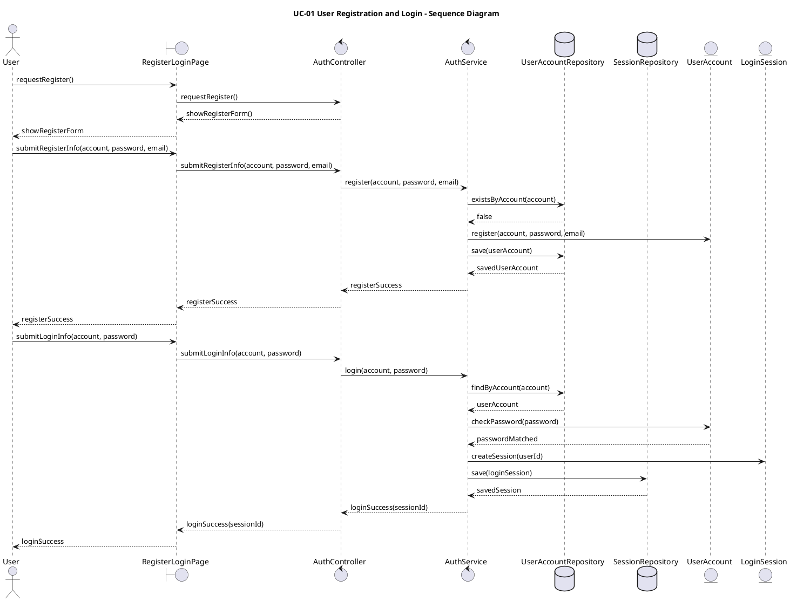
```puml
@startuml
title UC-01 User Registration and Login - Sequence Diagram

actor User
boundary RegisterLoginPage
control AuthController
control AuthService
database UserAccountRepository
database SessionRepository
entity UserAccount
entity LoginSession

User -> RegisterLoginPage : requestRegister()
RegisterLoginPage -> AuthController : requestRegister()
AuthController --> RegisterLoginPage : showRegisterForm()
RegisterLoginPage --> User : showRegisterForm

User -> RegisterLoginPage : submitRegisterInfo(account, password, email)
RegisterLoginPage -> AuthController : submitRegisterInfo(account, password, email)
AuthController -> AuthService : register(account, password, email)
AuthService -> UserAccountRepository : existsByAccount(account)
UserAccountRepository --> AuthService : false
AuthService -> UserAccount : register(account, password, email)
AuthService -> UserAccountRepository : save(userAccount)
UserAccountRepository --> AuthService : savedUserAccount
AuthService --> AuthController : registerSuccess
AuthController --> RegisterLoginPage : registerSuccess
RegisterLoginPage --> User : registerSuccess

User -> RegisterLoginPage : submitLoginInfo(account, password)
RegisterLoginPage -> AuthController : submitLoginInfo(account, password)
AuthController -> AuthService : login(account, password)
AuthService -> UserAccountRepository : findByAccount(account)
UserAccountRepository --> AuthService : userAccount
AuthService -> UserAccount : checkPassword(password)
UserAccount --> AuthService : passwordMatched
AuthService -> LoginSession : createSession(userId)
AuthService -> SessionRepository : save(loginSession)
SessionRepository --> AuthService : savedSession
AuthService --> AuthController : loginSuccess(sessionId)
AuthController --> RegisterLoginPage : loginSuccess(sessionId)
RegisterLoginPage --> User : loginSuccess

@enduml
```

### Collaboration Diagram

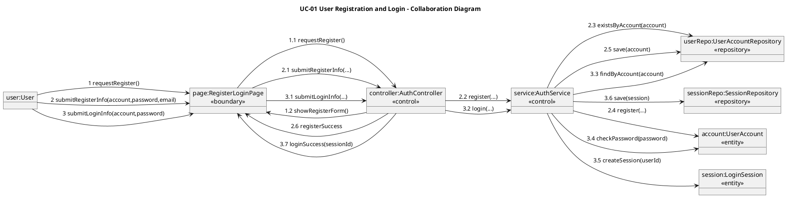
```puml
@startuml
title UC-01 User Registration and Login - Collaboration Diagram
left to right direction

object "user:User" as user
object "page:RegisterLoginPage\n<<boundary>>" as page
object "controller:AuthController\n<<control>>" as controller
object "service:AuthService\n<<control>>" as service
object "userRepo:UserAccountRepository\n<<repository>>" as userRepo
object "sessionRepo:SessionRepository\n<<repository>>" as sessionRepo
object "account:UserAccount\n<<entity>>" as account
object "session:LoginSession\n<<entity>>" as session

user --> page : 1 requestRegister()
page --> controller : 1.1 requestRegister()
controller --> page : 1.2 showRegisterForm()

user --> page : 2 submitRegisterInfo(account,password,email)
page --> controller : 2.1 submitRegisterInfo(...)
controller --> service : 2.2 register(...)
service --> userRepo : 2.3 existsByAccount(account)
service --> account : 2.4 register(...)
service --> userRepo : 2.5 save(account)
controller --> page : 2.6 registerSuccess

user --> page : 3 submitLoginInfo(account,password)
page --> controller : 3.1 submitLoginInfo(...)
controller --> service : 3.2 login(...)
service --> userRepo : 3.3 findByAccount(account)
service --> account : 3.4 checkPassword(password)
service --> session : 3.5 createSession(userId)
service --> sessionRepo : 3.6 save(session)
controller --> page : 3.7 loginSuccess(sessionId)

@enduml
```

### DCD

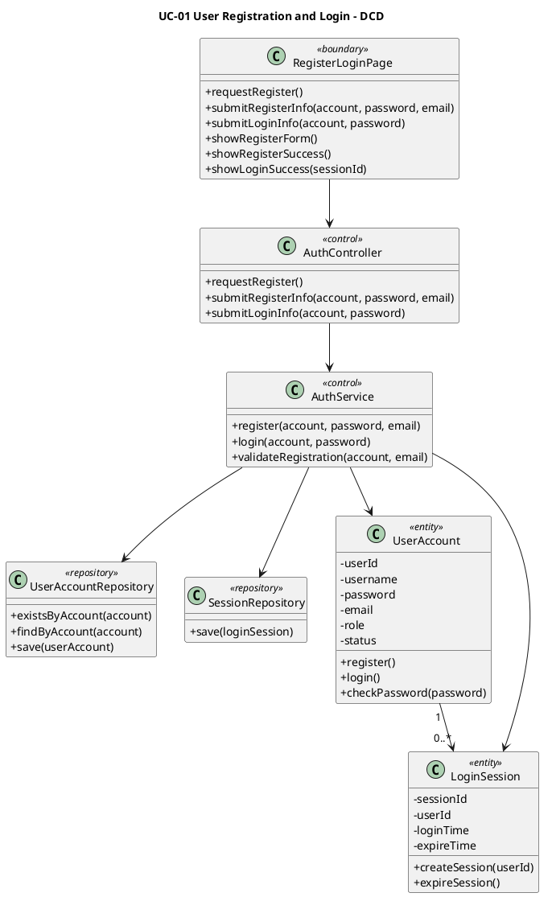
```puml
@startuml
title UC-01 User Registration and Login - DCD
skinparam classAttributeIconSize 0

class RegisterLoginPage <<boundary>> {
  +requestRegister()
  +submitRegisterInfo(account, password, email)
  +submitLoginInfo(account, password)
  +showRegisterForm()
  +showRegisterSuccess()
  +showLoginSuccess(sessionId)
}

class AuthController <<control>> {
  +requestRegister()
  +submitRegisterInfo(account, password, email)
  +submitLoginInfo(account, password)
}

class AuthService <<control>> {
  +register(account, password, email)
  +login(account, password)
  +validateRegistration(account, email)
}

class UserAccountRepository <<repository>> {
  +existsByAccount(account)
  +findByAccount(account)
  +save(userAccount)
}

class SessionRepository <<repository>> {
  +save(loginSession)
}

class UserAccount <<entity>> {
  -userId
  -username
  -password
  -email
  -role
  -status
  +register()
  +login()
  +checkPassword(password)
}

class LoginSession <<entity>> {
  -sessionId
  -userId
  -loginTime
  -expireTime
  +createSession(userId)
  +expireSession()
}

RegisterLoginPage --> AuthController
AuthController --> AuthService
AuthService --> UserAccountRepository
AuthService --> SessionRepository
AuthService --> UserAccount
AuthService --> LoginSession
UserAccount "1" --> "0..*" LoginSession

@enduml
```

---

## UC-02 Create Resume

### Sequence Diagram

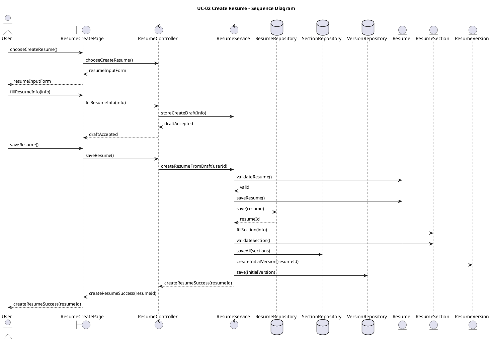
```puml
@startuml
title UC-02 Create Resume - Sequence Diagram

actor User
boundary ResumeCreatePage
control ResumeController
control ResumeService
database ResumeRepository
database SectionRepository
database VersionRepository
entity Resume
entity ResumeSection
entity ResumeVersion

User -> ResumeCreatePage : chooseCreateResume()
ResumeCreatePage -> ResumeController : chooseCreateResume()
ResumeController --> ResumeCreatePage : resumeInputForm
ResumeCreatePage --> User : resumeInputForm

User -> ResumeCreatePage : fillResumeInfo(info)
ResumeCreatePage -> ResumeController : fillResumeInfo(info)
ResumeController -> ResumeService : storeCreateDraft(info)
ResumeService --> ResumeController : draftAccepted
ResumeController --> ResumeCreatePage : draftAccepted

User -> ResumeCreatePage : saveResume()
ResumeCreatePage -> ResumeController : saveResume()
ResumeController -> ResumeService : createResumeFromDraft(userId)
ResumeService -> Resume : validateResume()
Resume --> ResumeService : valid
ResumeService -> Resume : saveResume()
ResumeService -> ResumeRepository : save(resume)
ResumeRepository --> ResumeService : resumeId
ResumeService -> ResumeSection : fillSection(info)
ResumeService -> ResumeSection : validateSection()
ResumeService -> SectionRepository : saveAll(sections)
ResumeService -> ResumeVersion : createInitialVersion(resumeId)
ResumeService -> VersionRepository : save(initialVersion)
ResumeService --> ResumeController : createResumeSuccess(resumeId)
ResumeController --> ResumeCreatePage : createResumeSuccess(resumeId)
ResumeCreatePage --> User : createResumeSuccess(resumeId)

@enduml
```

### Collaboration Diagram

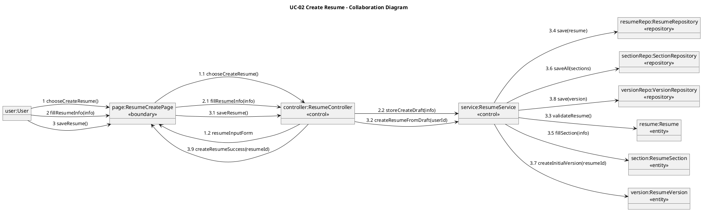
```puml
@startuml
title UC-02 Create Resume - Collaboration Diagram
left to right direction

object "user:User" as user
object "page:ResumeCreatePage\n<<boundary>>" as page
object "controller:ResumeController\n<<control>>" as controller
object "service:ResumeService\n<<control>>" as service
object "resumeRepo:ResumeRepository\n<<repository>>" as resumeRepo
object "sectionRepo:SectionRepository\n<<repository>>" as sectionRepo
object "versionRepo:VersionRepository\n<<repository>>" as versionRepo
object "resume:Resume\n<<entity>>" as resume
object "section:ResumeSection\n<<entity>>" as section
object "version:ResumeVersion\n<<entity>>" as version

user --> page : 1 chooseCreateResume()
page --> controller : 1.1 chooseCreateResume()
controller --> page : 1.2 resumeInputForm

user --> page : 2 fillResumeInfo(info)
page --> controller : 2.1 fillResumeInfo(info)
controller --> service : 2.2 storeCreateDraft(info)

user --> page : 3 saveResume()
page --> controller : 3.1 saveResume()
controller --> service : 3.2 createResumeFromDraft(userId)
service --> resume : 3.3 validateResume()
service --> resumeRepo : 3.4 save(resume)
service --> section : 3.5 fillSection(info)
service --> sectionRepo : 3.6 saveAll(sections)
service --> version : 3.7 createInitialVersion(resumeId)
service --> versionRepo : 3.8 save(version)
controller --> page : 3.9 createResumeSuccess(resumeId)

@enduml
```

### DCD

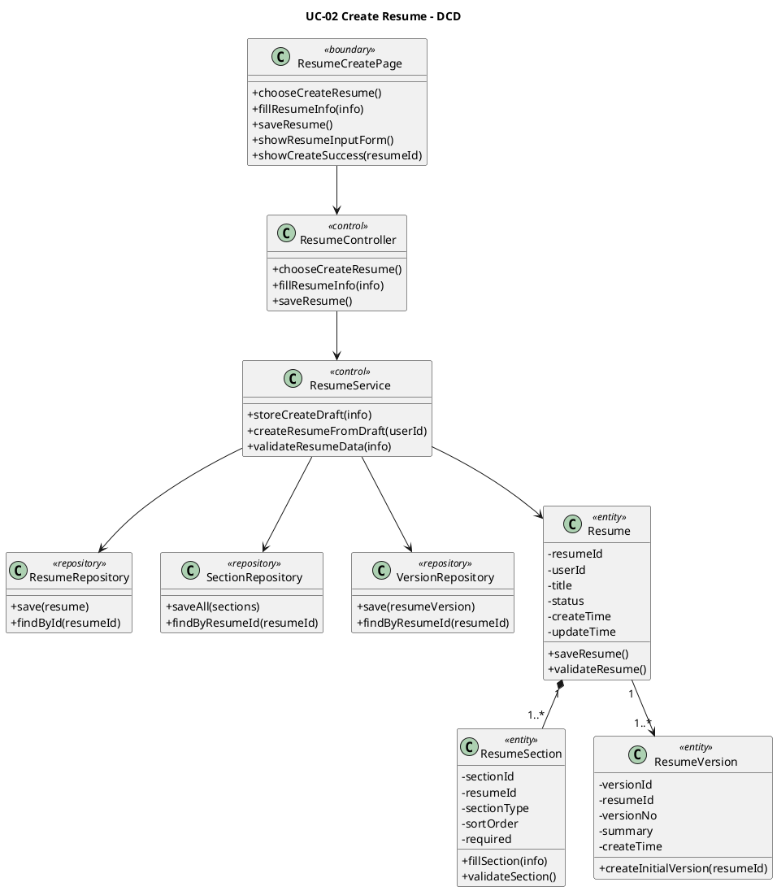
```puml
@startuml
title UC-02 Create Resume - DCD
skinparam classAttributeIconSize 0

class ResumeCreatePage <<boundary>> {
  +chooseCreateResume()
  +fillResumeInfo(info)
  +saveResume()
  +showResumeInputForm()
  +showCreateSuccess(resumeId)
}

class ResumeController <<control>> {
  +chooseCreateResume()
  +fillResumeInfo(info)
  +saveResume()
}

class ResumeService <<control>> {
  +storeCreateDraft(info)
  +createResumeFromDraft(userId)
  +validateResumeData(info)
}

class ResumeRepository <<repository>> {
  +save(resume)
  +findById(resumeId)
}

class SectionRepository <<repository>> {
  +saveAll(sections)
  +findByResumeId(resumeId)
}

class VersionRepository <<repository>> {
  +save(resumeVersion)
  +findByResumeId(resumeId)
}

class Resume <<entity>> {
  -resumeId
  -userId
  -title
  -status
  -createTime
  -updateTime
  +saveResume()
  +validateResume()
}

class ResumeSection <<entity>> {
  -sectionId
  -resumeId
  -sectionType
  -sortOrder
  -required
  +fillSection(info)
  +validateSection()
}

class ResumeVersion <<entity>> {
  -versionId
  -resumeId
  -versionNo
  -summary
  -createTime
  +createInitialVersion(resumeId)
}

ResumeCreatePage --> ResumeController
ResumeController --> ResumeService
ResumeService --> ResumeRepository
ResumeService --> SectionRepository
ResumeService --> VersionRepository
ResumeService --> Resume
Resume "1" *-- "1..*" ResumeSection
Resume "1" --> "1..*" ResumeVersion

@enduml
```

---

## UC-03 Convert PDF Resume to Online Resume

### Sequence Diagram

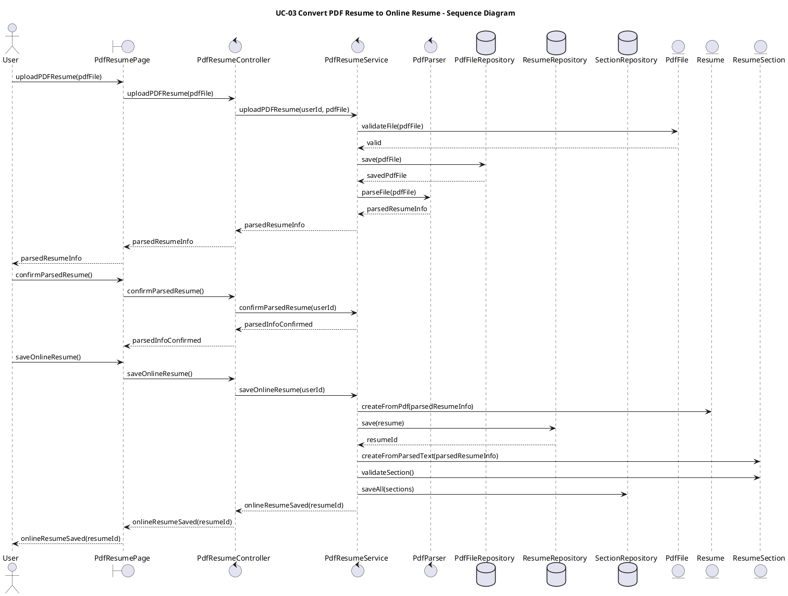
```puml
@startuml
title UC-03 Convert PDF Resume to Online Resume - Sequence Diagram

actor User
boundary PdfResumePage
control PdfResumeController
control PdfResumeService
control PdfParser
database PdfFileRepository
database ResumeRepository
database SectionRepository
entity PdfFile
entity Resume
entity ResumeSection

User -> PdfResumePage : uploadPDFResume(pdfFile)
PdfResumePage -> PdfResumeController : uploadPDFResume(pdfFile)
PdfResumeController -> PdfResumeService : uploadPDFResume(userId, pdfFile)
PdfResumeService -> PdfFile : validateFile(pdfFile)
PdfFile --> PdfResumeService : valid
PdfResumeService -> PdfFileRepository : save(pdfFile)
PdfFileRepository --> PdfResumeService : savedPdfFile
PdfResumeService -> PdfParser : parseFile(pdfFile)
PdfParser --> PdfResumeService : parsedResumeInfo
PdfResumeService --> PdfResumeController : parsedResumeInfo
PdfResumeController --> PdfResumePage : parsedResumeInfo
PdfResumePage --> User : parsedResumeInfo

User -> PdfResumePage : confirmParsedResume()
PdfResumePage -> PdfResumeController : confirmParsedResume()
PdfResumeController -> PdfResumeService : confirmParsedResume(userId)
PdfResumeService --> PdfResumeController : parsedInfoConfirmed
PdfResumeController --> PdfResumePage : parsedInfoConfirmed

User -> PdfResumePage : saveOnlineResume()
PdfResumePage -> PdfResumeController : saveOnlineResume()
PdfResumeController -> PdfResumeService : saveOnlineResume(userId)
PdfResumeService -> Resume : createFromPdf(parsedResumeInfo)
PdfResumeService -> ResumeRepository : save(resume)
ResumeRepository --> PdfResumeService : resumeId
PdfResumeService -> ResumeSection : createFromParsedText(parsedResumeInfo)
PdfResumeService -> ResumeSection : validateSection()
PdfResumeService -> SectionRepository : saveAll(sections)
PdfResumeService --> PdfResumeController : onlineResumeSaved(resumeId)
PdfResumeController --> PdfResumePage : onlineResumeSaved(resumeId)
PdfResumePage --> User : onlineResumeSaved(resumeId)

@enduml
```

### Collaboration Diagram

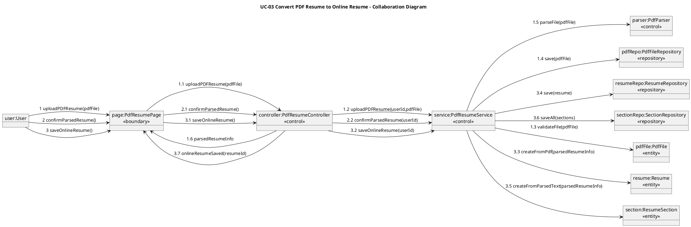
```puml
@startuml
title UC-03 Convert PDF Resume to Online Resume - Collaboration Diagram
left to right direction

object "user:User" as user
object "page:PdfResumePage\n<<boundary>>" as page
object "controller:PdfResumeController\n<<control>>" as controller
object "service:PdfResumeService\n<<control>>" as service
object "parser:PdfParser\n<<control>>" as parser
object "pdfRepo:PdfFileRepository\n<<repository>>" as pdfRepo
object "resumeRepo:ResumeRepository\n<<repository>>" as resumeRepo
object "sectionRepo:SectionRepository\n<<repository>>" as sectionRepo
object "pdfFile:PdfFile\n<<entity>>" as pdfFile
object "resume:Resume\n<<entity>>" as resume
object "section:ResumeSection\n<<entity>>" as section

user --> page : 1 uploadPDFResume(pdfFile)
page --> controller : 1.1 uploadPDFResume(pdfFile)
controller --> service : 1.2 uploadPDFResume(userId,pdfFile)
service --> pdfFile : 1.3 validateFile(pdfFile)
service --> pdfRepo : 1.4 save(pdfFile)
service --> parser : 1.5 parseFile(pdfFile)
controller --> page : 1.6 parsedResumeInfo

user --> page : 2 confirmParsedResume()
page --> controller : 2.1 confirmParsedResume()
controller --> service : 2.2 confirmParsedResume(userId)

user --> page : 3 saveOnlineResume()
page --> controller : 3.1 saveOnlineResume()
controller --> service : 3.2 saveOnlineResume(userId)
service --> resume : 3.3 createFromPdf(parsedResumeInfo)
service --> resumeRepo : 3.4 save(resume)
service --> section : 3.5 createFromParsedText(parsedResumeInfo)
service --> sectionRepo : 3.6 saveAll(sections)
controller --> page : 3.7 onlineResumeSaved(resumeId)

@enduml
```

### DCD

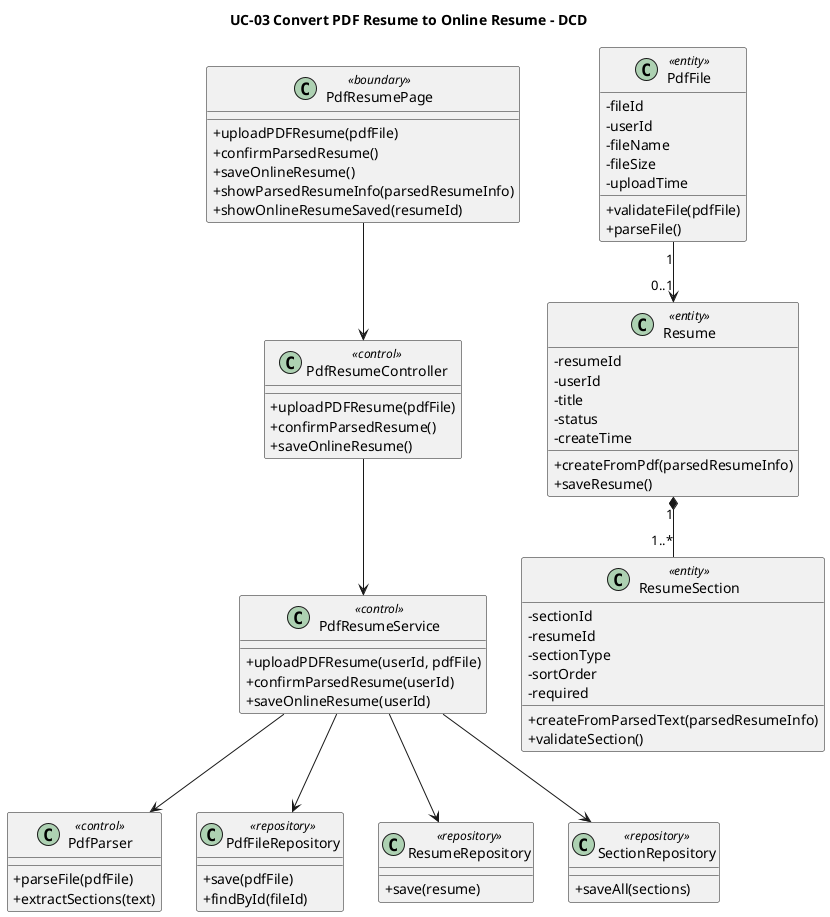
```puml
@startuml
title UC-03 Convert PDF Resume to Online Resume - DCD
skinparam classAttributeIconSize 0

class PdfResumePage <<boundary>> {
  +uploadPDFResume(pdfFile)
  +confirmParsedResume()
  +saveOnlineResume()
  +showParsedResumeInfo(parsedResumeInfo)
  +showOnlineResumeSaved(resumeId)
}

class PdfResumeController <<control>> {
  +uploadPDFResume(pdfFile)
  +confirmParsedResume()
  +saveOnlineResume()
}

class PdfResumeService <<control>> {
  +uploadPDFResume(userId, pdfFile)
  +confirmParsedResume(userId)
  +saveOnlineResume(userId)
}

class PdfParser <<control>> {
  +parseFile(pdfFile)
  +extractSections(text)
}

class PdfFileRepository <<repository>> {
  +save(pdfFile)
  +findById(fileId)
}

class ResumeRepository <<repository>> {
  +save(resume)
}

class SectionRepository <<repository>> {
  +saveAll(sections)
}

class PdfFile <<entity>> {
  -fileId
  -userId
  -fileName
  -fileSize
  -uploadTime
  +validateFile(pdfFile)
  +parseFile()
}

class Resume <<entity>> {
  -resumeId
  -userId
  -title
  -status
  -createTime
  +createFromPdf(parsedResumeInfo)
  +saveResume()
}

class ResumeSection <<entity>> {
  -sectionId
  -resumeId
  -sectionType
  -sortOrder
  -required
  +createFromParsedText(parsedResumeInfo)
  +validateSection()
}

PdfResumePage --> PdfResumeController
PdfResumeController --> PdfResumeService
PdfResumeService --> PdfParser
PdfResumeService --> PdfFileRepository
PdfResumeService --> ResumeRepository
PdfResumeService --> SectionRepository
PdfFile "1" --> "0..1" Resume
Resume "1" *-- "1..*" ResumeSection

@enduml
```

---

## UC-04 Edit Resume

### Sequence Diagram

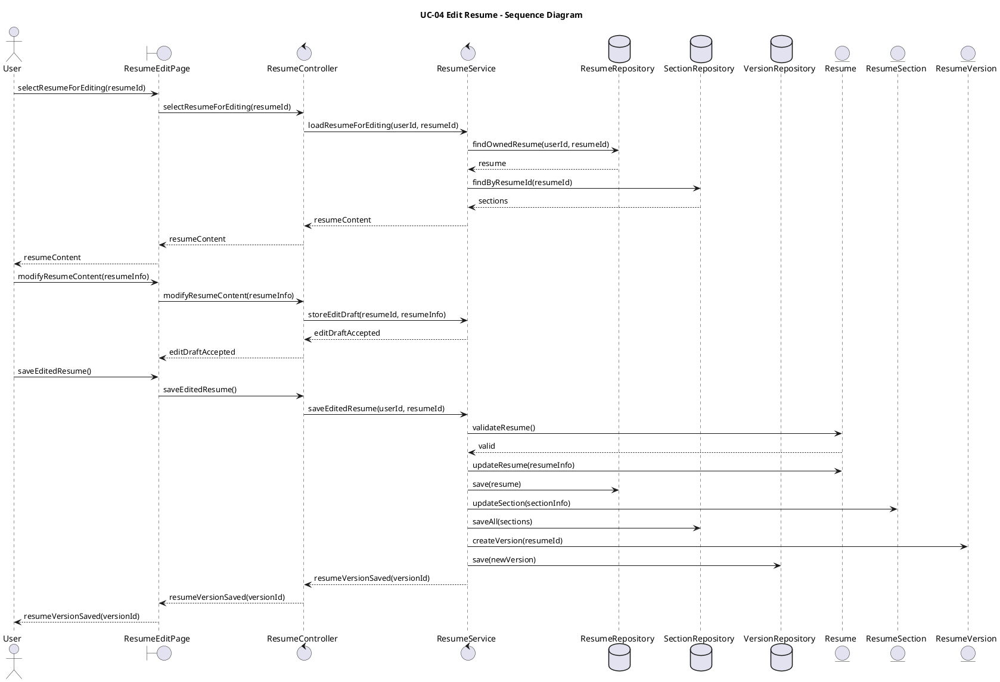
```puml
@startuml
title UC-04 Edit Resume - Sequence Diagram

actor User
boundary ResumeEditPage
control ResumeController
control ResumeService
database ResumeRepository
database SectionRepository
database VersionRepository
entity Resume
entity ResumeSection
entity ResumeVersion

User -> ResumeEditPage : selectResumeForEditing(resumeId)
ResumeEditPage -> ResumeController : selectResumeForEditing(resumeId)
ResumeController -> ResumeService : loadResumeForEditing(userId, resumeId)
ResumeService -> ResumeRepository : findOwnedResume(userId, resumeId)
ResumeRepository --> ResumeService : resume
ResumeService -> SectionRepository : findByResumeId(resumeId)
SectionRepository --> ResumeService : sections
ResumeService --> ResumeController : resumeContent
ResumeController --> ResumeEditPage : resumeContent
ResumeEditPage --> User : resumeContent

User -> ResumeEditPage : modifyResumeContent(resumeInfo)
ResumeEditPage -> ResumeController : modifyResumeContent(resumeInfo)
ResumeController -> ResumeService : storeEditDraft(resumeId, resumeInfo)
ResumeService --> ResumeController : editDraftAccepted
ResumeController --> ResumeEditPage : editDraftAccepted

User -> ResumeEditPage : saveEditedResume()
ResumeEditPage -> ResumeController : saveEditedResume()
ResumeController -> ResumeService : saveEditedResume(userId, resumeId)
ResumeService -> Resume : validateResume()
Resume --> ResumeService : valid
ResumeService -> Resume : updateResume(resumeInfo)
ResumeService -> ResumeRepository : save(resume)
ResumeService -> ResumeSection : updateSection(sectionInfo)
ResumeService -> SectionRepository : saveAll(sections)
ResumeService -> ResumeVersion : createVersion(resumeId)
ResumeService -> VersionRepository : save(newVersion)
ResumeService --> ResumeController : resumeVersionSaved(versionId)
ResumeController --> ResumeEditPage : resumeVersionSaved(versionId)
ResumeEditPage --> User : resumeVersionSaved(versionId)

@enduml
```

### Collaboration Diagram

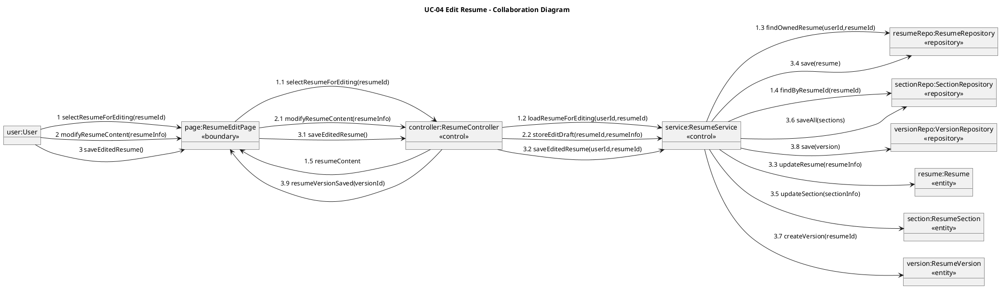
```puml
@startuml
title UC-04 Edit Resume - Collaboration Diagram
left to right direction

object "user:User" as user
object "page:ResumeEditPage\n<<boundary>>" as page
object "controller:ResumeController\n<<control>>" as controller
object "service:ResumeService\n<<control>>" as service
object "resumeRepo:ResumeRepository\n<<repository>>" as resumeRepo
object "sectionRepo:SectionRepository\n<<repository>>" as sectionRepo
object "versionRepo:VersionRepository\n<<repository>>" as versionRepo
object "resume:Resume\n<<entity>>" as resume
object "section:ResumeSection\n<<entity>>" as section
object "version:ResumeVersion\n<<entity>>" as version

user --> page : 1 selectResumeForEditing(resumeId)
page --> controller : 1.1 selectResumeForEditing(resumeId)
controller --> service : 1.2 loadResumeForEditing(userId,resumeId)
service --> resumeRepo : 1.3 findOwnedResume(userId,resumeId)
service --> sectionRepo : 1.4 findByResumeId(resumeId)
controller --> page : 1.5 resumeContent

user --> page : 2 modifyResumeContent(resumeInfo)
page --> controller : 2.1 modifyResumeContent(resumeInfo)
controller --> service : 2.2 storeEditDraft(resumeId,resumeInfo)

user --> page : 3 saveEditedResume()
page --> controller : 3.1 saveEditedResume()
controller --> service : 3.2 saveEditedResume(userId,resumeId)
service --> resume : 3.3 updateResume(resumeInfo)
service --> resumeRepo : 3.4 save(resume)
service --> section : 3.5 updateSection(sectionInfo)
service --> sectionRepo : 3.6 saveAll(sections)
service --> version : 3.7 createVersion(resumeId)
service --> versionRepo : 3.8 save(version)
controller --> page : 3.9 resumeVersionSaved(versionId)

@enduml
```

### DCD

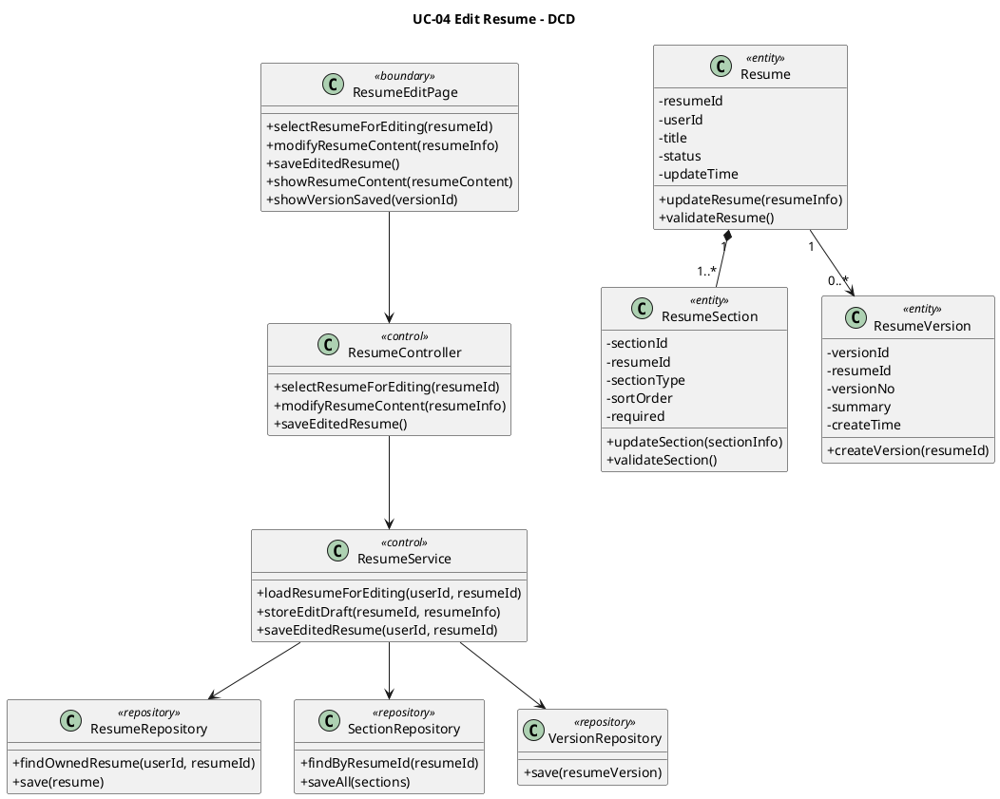
```puml
@startuml
title UC-04 Edit Resume - DCD
skinparam classAttributeIconSize 0

class ResumeEditPage <<boundary>> {
  +selectResumeForEditing(resumeId)
  +modifyResumeContent(resumeInfo)
  +saveEditedResume()
  +showResumeContent(resumeContent)
  +showVersionSaved(versionId)
}

class ResumeController <<control>> {
  +selectResumeForEditing(resumeId)
  +modifyResumeContent(resumeInfo)
  +saveEditedResume()
}

class ResumeService <<control>> {
  +loadResumeForEditing(userId, resumeId)
  +storeEditDraft(resumeId, resumeInfo)
  +saveEditedResume(userId, resumeId)
}

class ResumeRepository <<repository>> {
  +findOwnedResume(userId, resumeId)
  +save(resume)
}

class SectionRepository <<repository>> {
  +findByResumeId(resumeId)
  +saveAll(sections)
}

class VersionRepository <<repository>> {
  +save(resumeVersion)
}

class Resume <<entity>> {
  -resumeId
  -userId
  -title
  -status
  -updateTime
  +updateResume(resumeInfo)
  +validateResume()
}

class ResumeSection <<entity>> {
  -sectionId
  -resumeId
  -sectionType
  -sortOrder
  -required
  +updateSection(sectionInfo)
  +validateSection()
}

class ResumeVersion <<entity>> {
  -versionId
  -resumeId
  -versionNo
  -summary
  -createTime
  +createVersion(resumeId)
}

ResumeEditPage --> ResumeController
ResumeController --> ResumeService
ResumeService --> ResumeRepository
ResumeService --> SectionRepository
ResumeService --> VersionRepository
Resume "1" *-- "1..*" ResumeSection
Resume "1" --> "0..*" ResumeVersion

@enduml
```

---

## UC-05 Resume Optimization

### Sequence Diagram

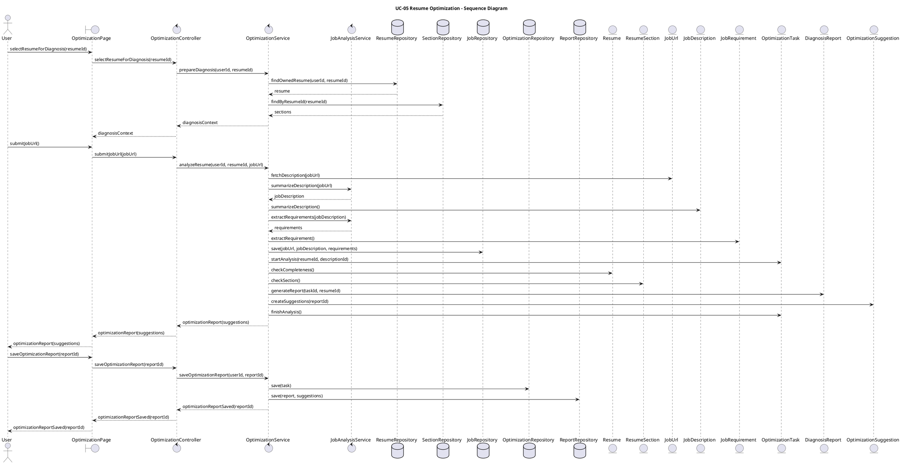
```puml
@startuml
title UC-05 Resume Optimization - Sequence Diagram

actor User
boundary OptimizationPage
control OptimizationController
control OptimizationService
control JobAnalysisService
database ResumeRepository
database SectionRepository
database JobRepository
database OptimizationRepository
database ReportRepository
entity Resume
entity ResumeSection
entity JobUrl
entity JobDescription
entity JobRequirement
entity OptimizationTask
entity DiagnosisReport
entity OptimizationSuggestion

User -> OptimizationPage : selectResumeForDiagnosis(resumeId)
OptimizationPage -> OptimizationController : selectResumeForDiagnosis(resumeId)
OptimizationController -> OptimizationService : prepareDiagnosis(userId, resumeId)
OptimizationService -> ResumeRepository : findOwnedResume(userId, resumeId)
ResumeRepository --> OptimizationService : resume
OptimizationService -> SectionRepository : findByResumeId(resumeId)
SectionRepository --> OptimizationService : sections
OptimizationService --> OptimizationController : diagnosisContext
OptimizationController --> OptimizationPage : diagnosisContext

User -> OptimizationPage : submitJobUrl()
OptimizationPage -> OptimizationController : submitJobUrl(jobUrl)
OptimizationController -> OptimizationService : analyzeResume(userId, resumeId, jobUrl)
OptimizationService -> JobUrl : fetchDescription(jobUrl)
OptimizationService -> JobAnalysisService : summarizeDescription(jobUrl)
JobAnalysisService --> OptimizationService : jobDescription
OptimizationService -> JobDescription : summarizeDescription()
OptimizationService -> JobAnalysisService : extractRequirements(jobDescription)
JobAnalysisService --> OptimizationService : requirements
OptimizationService -> JobRequirement : extractRequirement()
OptimizationService -> JobRepository : save(jobUrl, jobDescription, requirements)
OptimizationService -> OptimizationTask : startAnalysis(resumeId, descriptionId)
OptimizationService -> Resume : checkCompleteness()
OptimizationService -> ResumeSection : checkSection()
OptimizationService -> DiagnosisReport : generateReport(taskId, resumeId)
OptimizationService -> OptimizationSuggestion : createSuggestions(reportId)
OptimizationService -> OptimizationTask : finishAnalysis()
OptimizationService --> OptimizationController : optimizationReport(suggestions)
OptimizationController --> OptimizationPage : optimizationReport(suggestions)
OptimizationPage --> User : optimizationReport(suggestions)

User -> OptimizationPage : saveOptimizationReport(reportId)
OptimizationPage -> OptimizationController : saveOptimizationReport(reportId)
OptimizationController -> OptimizationService : saveOptimizationReport(userId, reportId)
OptimizationService -> OptimizationRepository : save(task)
OptimizationService -> ReportRepository : save(report, suggestions)
OptimizationService --> OptimizationController : optimizationReportSaved(reportId)
OptimizationController --> OptimizationPage : optimizationReportSaved(reportId)
OptimizationPage --> User : optimizationReportSaved(reportId)

@enduml
```

### Collaboration Diagram

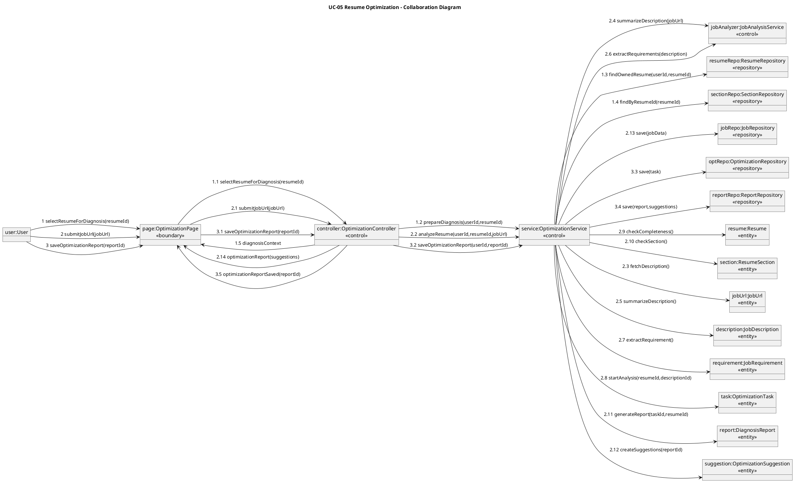
```puml
@startuml
title UC-05 Resume Optimization - Collaboration Diagram
left to right direction

object "user:User" as user
object "page:OptimizationPage\n<<boundary>>" as page
object "controller:OptimizationController\n<<control>>" as controller
object "service:OptimizationService\n<<control>>" as service
object "jobAnalyzer:JobAnalysisService\n<<control>>" as analyzer
object "resumeRepo:ResumeRepository\n<<repository>>" as resumeRepo
object "sectionRepo:SectionRepository\n<<repository>>" as sectionRepo
object "jobRepo:JobRepository\n<<repository>>" as jobRepo
object "optRepo:OptimizationRepository\n<<repository>>" as optRepo
object "reportRepo:ReportRepository\n<<repository>>" as reportRepo
object "resume:Resume\n<<entity>>" as resume
object "section:ResumeSection\n<<entity>>" as section
object "jobUrl:JobUrl\n<<entity>>" as jobUrl
object "description:JobDescription\n<<entity>>" as description
object "requirement:JobRequirement\n<<entity>>" as requirement
object "task:OptimizationTask\n<<entity>>" as task
object "report:DiagnosisReport\n<<entity>>" as report
object "suggestion:OptimizationSuggestion\n<<entity>>" as suggestion

user --> page : 1 selectResumeForDiagnosis(resumeId)
page --> controller : 1.1 selectResumeForDiagnosis(resumeId)
controller --> service : 1.2 prepareDiagnosis(userId,resumeId)
service --> resumeRepo : 1.3 findOwnedResume(userId,resumeId)
service --> sectionRepo : 1.4 findByResumeId(resumeId)
controller --> page : 1.5 diagnosisContext

user --> page : 2 submitJobUrl(jobUrl)
page --> controller : 2.1 submitJobUrl(jobUrl)
controller --> service : 2.2 analyzeResume(userId,resumeId,jobUrl)
service --> jobUrl : 2.3 fetchDescription()
service --> analyzer : 2.4 summarizeDescription(jobUrl)
service --> description : 2.5 summarizeDescription()
service --> analyzer : 2.6 extractRequirements(description)
service --> requirement : 2.7 extractRequirement()
service --> task : 2.8 startAnalysis(resumeId,descriptionId)
service --> resume : 2.9 checkCompleteness()
service --> section : 2.10 checkSection()
service --> report : 2.11 generateReport(taskId,resumeId)
service --> suggestion : 2.12 createSuggestions(reportId)
service --> jobRepo : 2.13 save(jobData)
controller --> page : 2.14 optimizationReport(suggestions)

user --> page : 3 saveOptimizationReport(reportId)
page --> controller : 3.1 saveOptimizationReport(reportId)
controller --> service : 3.2 saveOptimizationReport(userId,reportId)
service --> optRepo : 3.3 save(task)
service --> reportRepo : 3.4 save(report,suggestions)
controller --> page : 3.5 optimizationReportSaved(reportId)

@enduml
```

### DCD

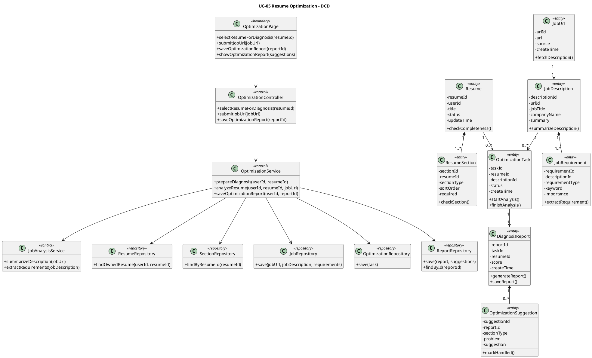
```puml
@startuml
title UC-05 Resume Optimization - DCD
skinparam classAttributeIconSize 0

class OptimizationPage <<boundary>> {
  +selectResumeForDiagnosis(resumeId)
  +submitJobUrl(jobUrl)
  +saveOptimizationReport(reportId)
  +showOptimizationReport(suggestions)
}

class OptimizationController <<control>> {
  +selectResumeForDiagnosis(resumeId)
  +submitJobUrl(jobUrl)
  +saveOptimizationReport(reportId)
}

class OptimizationService <<control>> {
  +prepareDiagnosis(userId, resumeId)
  +analyzeResume(userId, resumeId, jobUrl)
  +saveOptimizationReport(userId, reportId)
}

class JobAnalysisService <<control>> {
  +summarizeDescription(jobUrl)
  +extractRequirements(jobDescription)
}

class ResumeRepository <<repository>> {
  +findOwnedResume(userId, resumeId)
}

class SectionRepository <<repository>> {
  +findByResumeId(resumeId)
}

class JobRepository <<repository>> {
  +save(jobUrl, jobDescription, requirements)
}

class OptimizationRepository <<repository>> {
  +save(task)
}

class ReportRepository <<repository>> {
  +save(report, suggestions)
  +findById(reportId)
}

class Resume <<entity>> {
  -resumeId
  -userId
  -title
  -status
  -updateTime
  +checkCompleteness()
}

class ResumeSection <<entity>> {
  -sectionId
  -resumeId
  -sectionType
  -sortOrder
  -required
  +checkSection()
}

class JobUrl <<entity>> {
  -urlId
  -url
  -source
  -createTime
  +fetchDescription()
}

class JobDescription <<entity>> {
  -descriptionId
  -urlId
  -jobTitle
  -companyName
  -summary
  +summarizeDescription()
}

class JobRequirement <<entity>> {
  -requirementId
  -descriptionId
  -requirementType
  -keyword
  -importance
  +extractRequirement()
}

class OptimizationTask <<entity>> {
  -taskId
  -resumeId
  -descriptionId
  -status
  -createTime
  +startAnalysis()
  +finishAnalysis()
}

class DiagnosisReport <<entity>> {
  -reportId
  -taskId
  -resumeId
  -score
  -createTime
  +generateReport()
  +saveReport()
}

class OptimizationSuggestion <<entity>> {
  -suggestionId
  -reportId
  -sectionType
  -problem
  -suggestion
  +markHandled()
}

OptimizationPage --> OptimizationController
OptimizationController --> OptimizationService
OptimizationService --> JobAnalysisService
OptimizationService --> ResumeRepository
OptimizationService --> SectionRepository
OptimizationService --> JobRepository
OptimizationService --> OptimizationRepository
OptimizationService --> ReportRepository
Resume "1" *-- "1..*" ResumeSection
JobUrl "1" --> "1" JobDescription
JobDescription "1" *-- "1..*" JobRequirement
Resume "1" --> "0..*" OptimizationTask
JobDescription "1" --> "0..*" OptimizationTask
OptimizationTask "1" --> "1" DiagnosisReport
DiagnosisReport "1" *-- "0..*" OptimizationSuggestion

@enduml
```

---

## UC-06 Export Resume

### Sequence Diagram

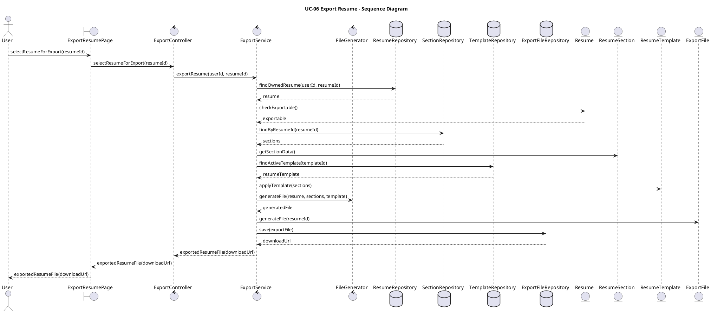
```puml
@startuml
title UC-06 Export Resume - Sequence Diagram

actor User
boundary ExportResumePage
control ExportController
control ExportService
control FileGenerator
database ResumeRepository
database SectionRepository
database TemplateRepository
database ExportFileRepository
entity Resume
entity ResumeSection
entity ResumeTemplate
entity ExportFile

User -> ExportResumePage : selectResumeForExport(resumeId)
ExportResumePage -> ExportController : selectResumeForExport(resumeId)
ExportController -> ExportService : exportResume(userId, resumeId)
ExportService -> ResumeRepository : findOwnedResume(userId, resumeId)
ResumeRepository --> ExportService : resume
ExportService -> Resume : checkExportable()
Resume --> ExportService : exportable
ExportService -> SectionRepository : findByResumeId(resumeId)
SectionRepository --> ExportService : sections
ExportService -> ResumeSection : getSectionData()
ExportService -> TemplateRepository : findActiveTemplate(templateId)
TemplateRepository --> ExportService : resumeTemplate
ExportService -> ResumeTemplate : applyTemplate(sections)
ExportService -> FileGenerator : generateFile(resume, sections, template)
FileGenerator --> ExportService : generatedFile
ExportService -> ExportFile : generateFile(resumeId)
ExportService -> ExportFileRepository : save(exportFile)
ExportFileRepository --> ExportService : downloadUrl
ExportService --> ExportController : exportedResumeFile(downloadUrl)
ExportController --> ExportResumePage : exportedResumeFile(downloadUrl)
ExportResumePage --> User : exportedResumeFile(downloadUrl)

@enduml
```

### Collaboration Diagram

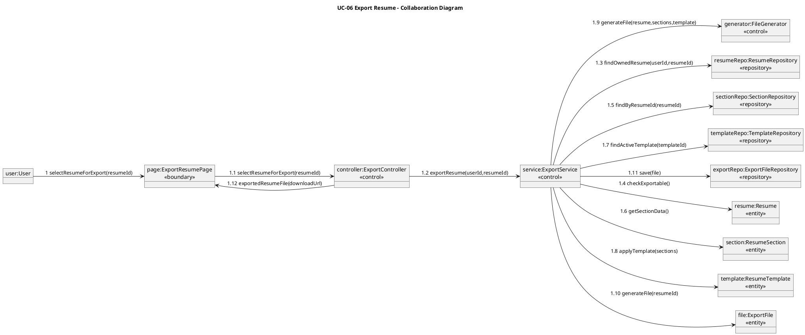
```puml
@startuml
title UC-06 Export Resume - Collaboration Diagram
left to right direction

object "user:User" as user
object "page:ExportResumePage\n<<boundary>>" as page
object "controller:ExportController\n<<control>>" as controller
object "service:ExportService\n<<control>>" as service
object "generator:FileGenerator\n<<control>>" as generator
object "resumeRepo:ResumeRepository\n<<repository>>" as resumeRepo
object "sectionRepo:SectionRepository\n<<repository>>" as sectionRepo
object "templateRepo:TemplateRepository\n<<repository>>" as templateRepo
object "exportRepo:ExportFileRepository\n<<repository>>" as exportRepo
object "resume:Resume\n<<entity>>" as resume
object "section:ResumeSection\n<<entity>>" as section
object "template:ResumeTemplate\n<<entity>>" as template
object "file:ExportFile\n<<entity>>" as file

user --> page : 1 selectResumeForExport(resumeId)
page --> controller : 1.1 selectResumeForExport(resumeId)
controller --> service : 1.2 exportResume(userId,resumeId)
service --> resumeRepo : 1.3 findOwnedResume(userId,resumeId)
service --> resume : 1.4 checkExportable()
service --> sectionRepo : 1.5 findByResumeId(resumeId)
service --> section : 1.6 getSectionData()
service --> templateRepo : 1.7 findActiveTemplate(templateId)
service --> template : 1.8 applyTemplate(sections)
service --> generator : 1.9 generateFile(resume,sections,template)
service --> file : 1.10 generateFile(resumeId)
service --> exportRepo : 1.11 save(file)
controller --> page : 1.12 exportedResumeFile(downloadUrl)

@enduml
```

### DCD

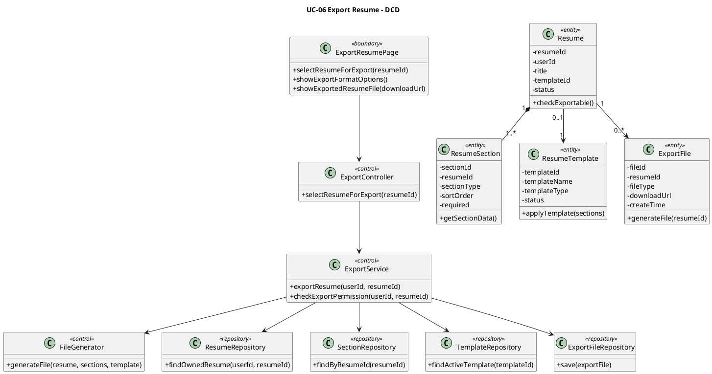
```puml
@startuml
title UC-06 Export Resume - DCD
skinparam classAttributeIconSize 0

class ExportResumePage <<boundary>> {
  +selectResumeForExport(resumeId)
  +showExportFormatOptions()
  +showExportedResumeFile(downloadUrl)
}

class ExportController <<control>> {
  +selectResumeForExport(resumeId)
}

class ExportService <<control>> {
  +exportResume(userId, resumeId)
  +checkExportPermission(userId, resumeId)
}

class FileGenerator <<control>> {
  +generateFile(resume, sections, template)
}

class ResumeRepository <<repository>> {
  +findOwnedResume(userId, resumeId)
}

class SectionRepository <<repository>> {
  +findByResumeId(resumeId)
}

class TemplateRepository <<repository>> {
  +findActiveTemplate(templateId)
}

class ExportFileRepository <<repository>> {
  +save(exportFile)
}

class Resume <<entity>> {
  -resumeId
  -userId
  -title
  -templateId
  -status
  +checkExportable()
}

class ResumeSection <<entity>> {
  -sectionId
  -resumeId
  -sectionType
  -sortOrder
  -required
  +getSectionData()
}

class ResumeTemplate <<entity>> {
  -templateId
  -templateName
  -templateType
  -status
  +applyTemplate(sections)
}

class ExportFile <<entity>> {
  -fileId
  -resumeId
  -fileType
  -downloadUrl
  -createTime
  +generateFile(resumeId)
}

ExportResumePage --> ExportController
ExportController --> ExportService
ExportService --> FileGenerator
ExportService --> ResumeRepository
ExportService --> SectionRepository
ExportService --> TemplateRepository
ExportService --> ExportFileRepository
Resume "1" *-- "1..*" ResumeSection
Resume "0..1" --> "1" ResumeTemplate
Resume "1" --> "0..*" ExportFile

@enduml
```

---

## UC-07 Resume Version Management

### Sequence Diagram

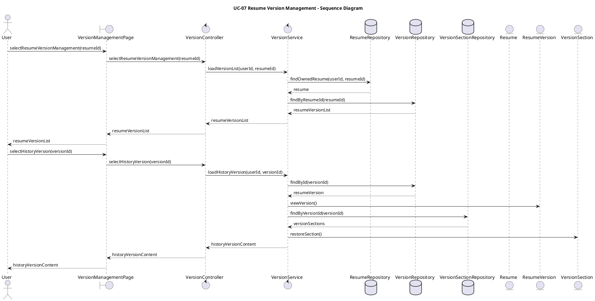
```puml
@startuml
title UC-07 Resume Version Management - Sequence Diagram

actor User
boundary VersionManagementPage
control VersionController
control VersionService
database ResumeRepository
database VersionRepository
database VersionSectionRepository
entity Resume
entity ResumeVersion
entity VersionSection

User -> VersionManagementPage : selectResumeVersionManagement(resumeId)
VersionManagementPage -> VersionController : selectResumeVersionManagement(resumeId)
VersionController -> VersionService : loadVersionList(userId, resumeId)
VersionService -> ResumeRepository : findOwnedResume(userId, resumeId)
ResumeRepository --> VersionService : resume
VersionService -> VersionRepository : findByResumeId(resumeId)
VersionRepository --> VersionService : resumeVersionList
VersionService --> VersionController : resumeVersionList
VersionController --> VersionManagementPage : resumeVersionList
VersionManagementPage --> User : resumeVersionList

User -> VersionManagementPage : selectHistoryVersion(versionId)
VersionManagementPage -> VersionController : selectHistoryVersion(versionId)
VersionController -> VersionService : loadHistoryVersion(userId, versionId)
VersionService -> VersionRepository : findById(versionId)
VersionRepository --> VersionService : resumeVersion
VersionService -> ResumeVersion : viewVersion()
VersionService -> VersionSectionRepository : findByVersionId(versionId)
VersionSectionRepository --> VersionService : versionSections
VersionService -> VersionSection : restoreSection()
VersionService --> VersionController : historyVersionContent
VersionController --> VersionManagementPage : historyVersionContent
VersionManagementPage --> User : historyVersionContent

@enduml
```

### Collaboration Diagram

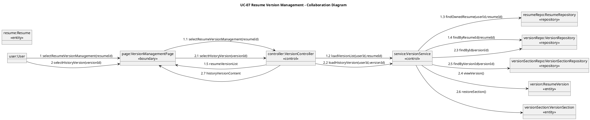
```puml
@startuml
title UC-07 Resume Version Management - Collaboration Diagram
left to right direction

object "user:User" as user
object "page:VersionManagementPage\n<<boundary>>" as page
object "controller:VersionController\n<<control>>" as controller
object "service:VersionService\n<<control>>" as service
object "resumeRepo:ResumeRepository\n<<repository>>" as resumeRepo
object "versionRepo:VersionRepository\n<<repository>>" as versionRepo
object "versionSectionRepo:VersionSectionRepository\n<<repository>>" as versionSectionRepo
object "resume:Resume\n<<entity>>" as resume
object "version:ResumeVersion\n<<entity>>" as version
object "versionSection:VersionSection\n<<entity>>" as versionSection

user --> page : 1 selectResumeVersionManagement(resumeId)
page --> controller : 1.1 selectResumeVersionManagement(resumeId)
controller --> service : 1.2 loadVersionList(userId,resumeId)
service --> resumeRepo : 1.3 findOwnedResume(userId,resumeId)
service --> versionRepo : 1.4 findByResumeId(resumeId)
controller --> page : 1.5 resumeVersionList

user --> page : 2 selectHistoryVersion(versionId)
page --> controller : 2.1 selectHistoryVersion(versionId)
controller --> service : 2.2 loadHistoryVersion(userId,versionId)
service --> versionRepo : 2.3 findById(versionId)
service --> version : 2.4 viewVersion()
service --> versionSectionRepo : 2.5 findByVersionId(versionId)
service --> versionSection : 2.6 restoreSection()
controller --> page : 2.7 historyVersionContent

@enduml
```

### DCD

```puml
@startuml
title UC-07 Resume Version Management - DCD
skinparam classAttributeIconSize 0

class VersionManagementPage <<boundary>> {
  +selectResumeVersionManagement(resumeId)
  +selectHistoryVersion(versionId)
  +showResumeVersionList(versionList)
  +showHistoryVersionContent(content)
}

class VersionController <<control>> {
  +selectResumeVersionManagement(resumeId)
  +selectHistoryVersion(versionId)
}

class VersionService <<control>> {
  +loadVersionList(userId, resumeId)
  +loadHistoryVersion(userId, versionId)
  +rollbackToVersion(userId, resumeId, versionId)
}

class ResumeRepository <<repository>> {
  +findOwnedResume(userId, resumeId)
  +save(resume)
}

class VersionRepository <<repository>> {
  +findByResumeId(resumeId)
  +findById(versionId)
  +save(resumeVersion)
}

class VersionSectionRepository <<repository>> {
  +findByVersionId(versionId)
}

class Resume <<entity>> {
  -resumeId
  -userId
  -title
  -currentVersionNo
  -updateTime
  +rollbackToVersion(versionId)
}

class ResumeVersion <<entity>> {
  -versionId
  -resumeId
  -versionNo
  -summary
  -createTime
  +viewVersion()
  +compareWithCurrent()
}

class VersionSection <<entity>> {
  -versionSectionId
  -versionId
  -sectionType
  -sortOrder
  +restoreSection()
}

VersionManagementPage --> VersionController
VersionController --> VersionService
VersionService --> ResumeRepository
VersionService --> VersionRepository
VersionService --> VersionSectionRepository
Resume "1" --> "1..*" ResumeVersion
ResumeVersion "1" *-- "1..*" VersionSection

@enduml
```

---

## UC-08 Manage User Accounts

### Sequence Diagram

```puml
@startuml
title UC-08 Manage User Accounts - Sequence Diagram

actor Admin
boundary UserManagementPage
control UserManagementController
control UserManagementService
database AdminRepository
database UserAccountRepository
entity UserAccount

Admin -> UserManagementPage : selectUserManagement()
UserManagementPage -> UserManagementController : selectUserManagement()
UserManagementController -> UserManagementService : loadUserManagement(adminId)
UserManagementService -> AdminRepository : checkPermission(adminId, "USER_MANAGE")
AdminRepository --> UserManagementService : permitted
UserManagementService -> UserAccountRepository : findAll()
UserAccountRepository --> UserManagementService : userList
UserManagementService --> UserManagementController : userList
UserManagementController --> UserManagementPage : userList
UserManagementPage --> Admin : userList

Admin -> UserManagementPage : searchUser(queryCondition)
UserManagementPage -> UserManagementController : searchUser(queryCondition)
UserManagementController -> UserManagementService : searchUser(queryCondition)
UserManagementService -> UserAccountRepository : search(queryCondition)
UserAccountRepository --> UserManagementService : userSearchResult
UserManagementService --> UserManagementController : userSearchResult
UserManagementController --> UserManagementPage : userSearchResult
UserManagementPage --> Admin : userSearchResult

Admin -> UserManagementPage : disableUser(userId)
UserManagementPage -> UserManagementController : disableUser(userId)
UserManagementController -> UserManagementService : prepareDisable(userId)
UserManagementService -> UserAccountRepository : findById(userId)
UserAccountRepository --> UserManagementService : userAccount
UserManagementService --> UserManagementController : disableConfirm
UserManagementController --> UserManagementPage : disableConfirm
UserManagementPage --> Admin : disableConfirm

Admin -> UserManagementPage : confirmDisable()
UserManagementPage -> UserManagementController : confirmDisable()
UserManagementController -> UserManagementService : confirmDisable(adminId, userId)
UserManagementService -> UserAccount : changeStatus("disabled")
UserManagementService -> UserAccountRepository : save(userAccount)
UserAccountRepository --> UserManagementService : savedUserAccount
UserManagementService --> UserManagementController : disableUserSuccess(userId)
UserManagementController --> UserManagementPage : disableUserSuccess(userId)
UserManagementPage --> Admin : disableUserSuccess(userId)

@enduml
```

### Collaboration Diagram

```puml
@startuml
title UC-08 Manage User Accounts - Collaboration Diagram
left to right direction

object "admin:Admin" as admin
object "page:UserManagementPage\n<<boundary>>" as page
object "controller:UserManagementController\n<<control>>" as controller
object "service:UserManagementService\n<<control>>" as service
object "adminRepo:AdminRepository\n<<repository>>" as adminRepo
object "userRepo:UserAccountRepository\n<<repository>>" as userRepo
object "account:UserAccount\n<<entity>>" as account

admin --> page : 1 selectUserManagement()
page --> controller : 1.1 selectUserManagement()
controller --> service : 1.2 loadUserManagement(adminId)
service --> adminRepo : 1.3 checkPermission(adminId)
service --> userRepo : 1.4 findAll()
controller --> page : 1.5 userList

admin --> page : 2 searchUser(queryCondition)
page --> controller : 2.1 searchUser(queryCondition)
controller --> service : 2.2 searchUser(queryCondition)
service --> userRepo : 2.3 search(queryCondition)
controller --> page : 2.4 userSearchResult

admin --> page : 3 disableUser(userId)
page --> controller : 3.1 disableUser(userId)
controller --> service : 3.2 prepareDisable(userId)
service --> userRepo : 3.3 findById(userId)
controller --> page : 3.4 disableConfirm

admin --> page : 4 confirmDisable()
page --> controller : 4.1 confirmDisable()
controller --> service : 4.2 confirmDisable(adminId,userId)
service --> account : 4.3 changeStatus("disabled")
service --> userRepo : 4.4 save(account)
controller --> page : 4.5 disableUserSuccess(userId)

@enduml
```

### DCD

```puml
@startuml
title UC-08 Manage User Accounts - DCD
skinparam classAttributeIconSize 0

class UserManagementPage <<boundary>> {
  +selectUserManagement()
  +searchUser(queryCondition)
  +disableUser(userId)
  +confirmDisable()
  +showUserList(userList)
  +showDisableConfirm(userId)
}

class UserManagementController <<control>> {
  +selectUserManagement()
  +searchUser(queryCondition)
  +disableUser(userId)
  +confirmDisable()
}

class UserManagementService <<control>> {
  +loadUserManagement(adminId)
  +searchUser(queryCondition)
  +prepareDisable(userId)
  +confirmDisable(adminId, userId)
}

class AdminRepository <<repository>> {
  +checkPermission(adminId, permission)
}

class UserAccountRepository <<repository>> {
  +findAll()
  +search(queryCondition)
  +findById(userId)
  +save(userAccount)
}

class Admin <<entity>> {
  -adminId
  -username
  -role
  -status
  +searchUser()
  +disableUser()
}

class UserAccount <<entity>> {
  -userId
  -username
  -email
  -status
  -registerTime
  +changeStatus(status)
}

UserManagementPage --> UserManagementController
UserManagementController --> UserManagementService
UserManagementService --> AdminRepository
UserManagementService --> UserAccountRepository
UserManagementService --> UserAccount
Admin "1" --> "0..*" UserAccount

@enduml
```

---

## UC-09 View System Logs

### Sequence Diagram

```puml
@startuml
title UC-09 View System Logs - Sequence Diagram

actor Admin
boundary SystemLogPage
control SystemLogController
control SystemLogService
database AdminRepository
database SystemLogRepository
entity SystemLog

Admin -> SystemLogPage : selectSystemLog()
SystemLogPage -> SystemLogController : selectSystemLog()
SystemLogController -> SystemLogService : loadSystemLogs(adminId)
SystemLogService -> AdminRepository : checkPermission(adminId, "LOG_VIEW")
AdminRepository --> SystemLogService : permitted
SystemLogService -> SystemLogRepository : findRecentLogs()
SystemLogRepository --> SystemLogService : systemLogList
SystemLogService --> SystemLogController : systemLogList
SystemLogController --> SystemLogPage : systemLogList
SystemLogPage --> Admin : systemLogList

Admin -> SystemLogPage : filterLogs(filterCondition)
SystemLogPage -> SystemLogController : filterLogs(filterCondition)
SystemLogController -> SystemLogService : filterLogs(adminId, filterCondition)
SystemLogService -> SystemLogRepository : findByCondition(filterCondition)
SystemLogRepository --> SystemLogService : filteredLogList
SystemLogService --> SystemLogController : filteredLogList
SystemLogController --> SystemLogPage : filteredLogList
SystemLogPage --> Admin : filteredLogList

Admin -> SystemLogPage : selectLogDetail(logId)
SystemLogPage -> SystemLogController : selectLogDetail(logId)
SystemLogController -> SystemLogService : loadLogDetail(adminId, logId)
SystemLogService -> SystemLogRepository : findById(logId)
SystemLogRepository --> SystemLogService : systemLog
SystemLogService -> SystemLog : viewDetail()
SystemLog --> SystemLogService : logDetail
SystemLogService --> SystemLogController : logDetail
SystemLogController --> SystemLogPage : logDetail
SystemLogPage --> Admin : logDetail

@enduml
```

### Collaboration Diagram

```puml
@startuml
title UC-09 View System Logs - Collaboration Diagram
left to right direction

object "admin:Admin" as admin
object "page:SystemLogPage\n<<boundary>>" as page
object "controller:SystemLogController\n<<control>>" as controller
object "service:SystemLogService\n<<control>>" as service
object "adminRepo:AdminRepository\n<<repository>>" as adminRepo
object "logRepo:SystemLogRepository\n<<repository>>" as logRepo
object "log:SystemLog\n<<entity>>" as log

admin --> page : 1 selectSystemLog()
page --> controller : 1.1 selectSystemLog()
controller --> service : 1.2 loadSystemLogs(adminId)
service --> adminRepo : 1.3 checkPermission(adminId)
service --> logRepo : 1.4 findRecentLogs()
controller --> page : 1.5 systemLogList

admin --> page : 2 filterLogs(filterCondition)
page --> controller : 2.1 filterLogs(filterCondition)
controller --> service : 2.2 filterLogs(adminId,filterCondition)
service --> logRepo : 2.3 findByCondition(filterCondition)
controller --> page : 2.4 filteredLogList

admin --> page : 3 selectLogDetail(logId)
page --> controller : 3.1 selectLogDetail(logId)
controller --> service : 3.2 loadLogDetail(adminId,logId)
service --> logRepo : 3.3 findById(logId)
service --> log : 3.4 viewDetail()
controller --> page : 3.5 logDetail

@enduml
```

### DCD

```puml
@startuml
title UC-09 View System Logs - DCD
skinparam classAttributeIconSize 0

class SystemLogPage <<boundary>> {
  +selectSystemLog()
  +filterLogs(filterCondition)
  +selectLogDetail(logId)
  +showSystemLogList(logList)
  +showLogDetail(logDetail)
}

class SystemLogController <<control>> {
  +selectSystemLog()
  +filterLogs(filterCondition)
  +selectLogDetail(logId)
}

class SystemLogService <<control>> {
  +loadSystemLogs(adminId)
  +filterLogs(adminId, filterCondition)
  +loadLogDetail(adminId, logId)
}

class AdminRepository <<repository>> {
  +checkPermission(adminId, permission)
}

class SystemLogRepository <<repository>> {
  +findRecentLogs()
  +findByCondition(filterCondition)
  +findById(logId)
}

class Admin <<entity>> {
  -adminId
  -username
  -role
  -status
  +viewLogs()
  +filterLogs()
}

class SystemLog <<entity>> {
  -logId
  -operatorId
  -actionType
  -summary
  -createTime
  +viewDetail()
}

SystemLogPage --> SystemLogController
SystemLogController --> SystemLogService
SystemLogService --> AdminRepository
SystemLogService --> SystemLogRepository
SystemLogService --> SystemLog
Admin "1" --> "0..*" SystemLog

@enduml
```
