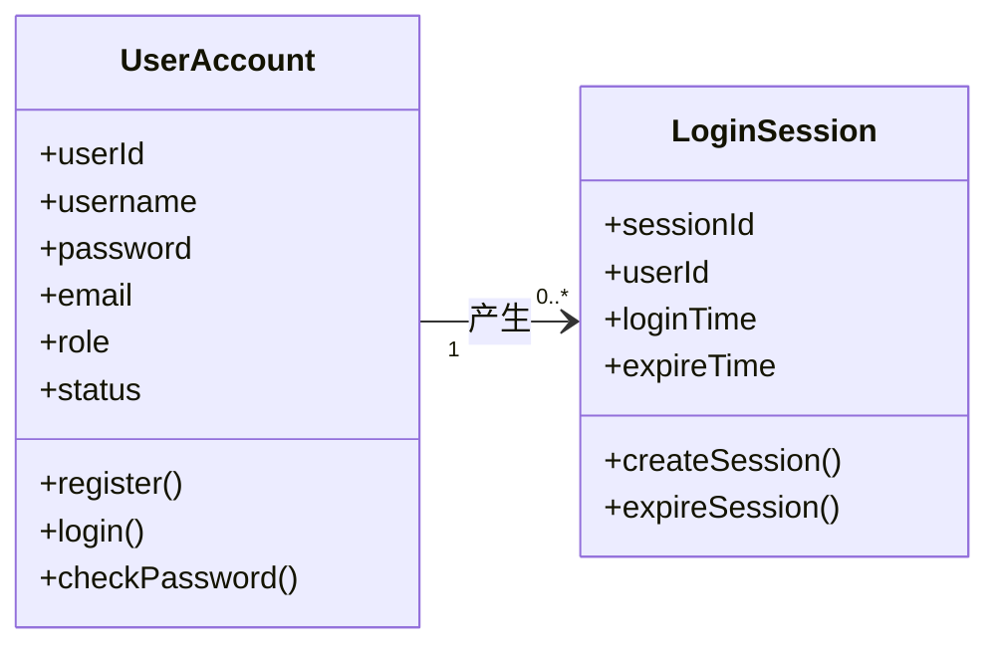
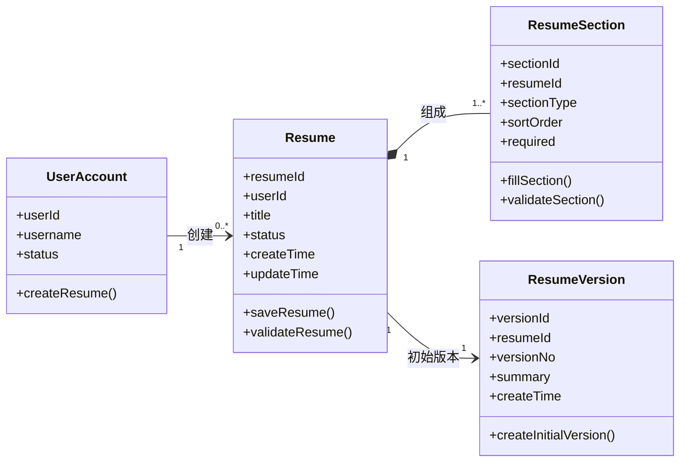
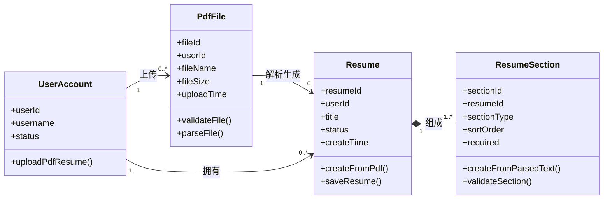
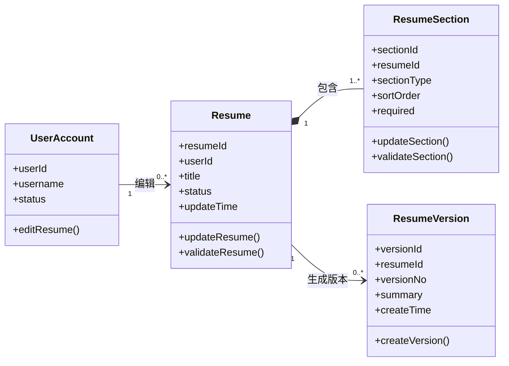
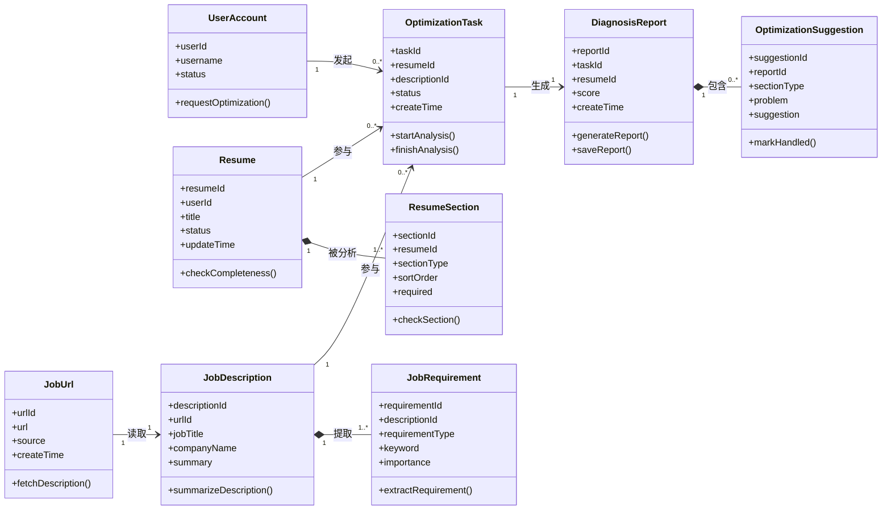
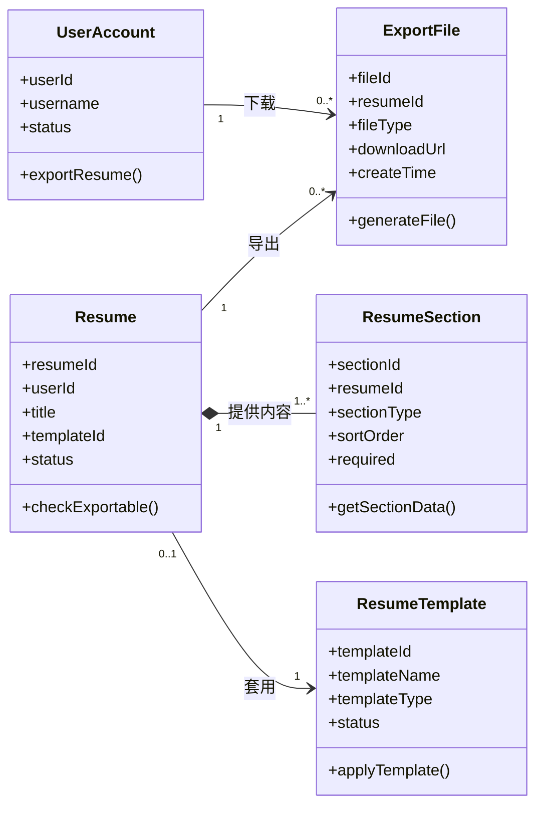
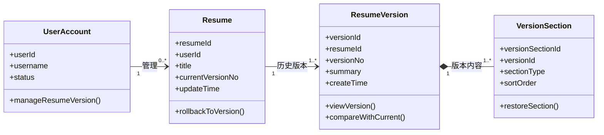
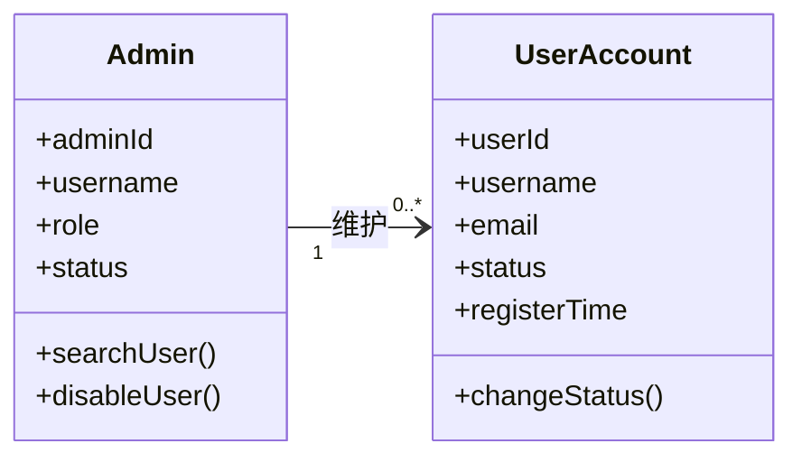
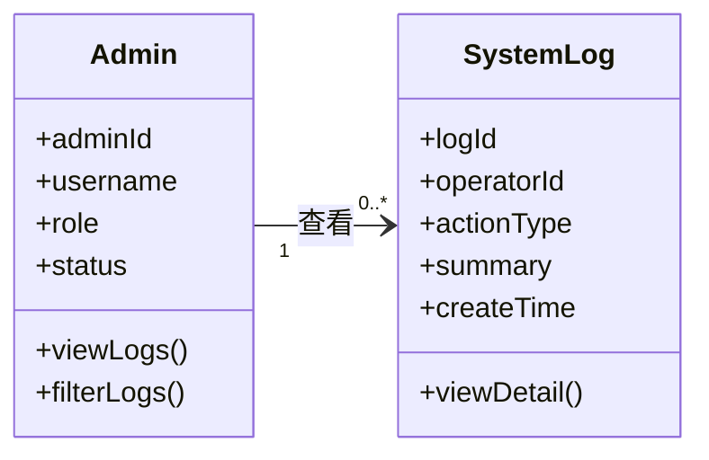

# 领域建模

本部分按照用例分别建立领域模型。每个领域模型只描述该用例中直接相关的核心概念类、简单属性、必要业务方法和主要关系，不追求覆盖系统全部对象。

说明：简历内容不是 `Resume` 的简单属性。因为简历内容由基本信息、教育经历、项目经历、技能等多个模块组成，属于复合属性，所以在领域模型中抽象为 `ResumeSection` 与 `Resume` 关联。

## UC-01 用户注册与登录

### 概念类

| 概念类 | 说明 |
|---|---|
| UserAccount 用户账号 | 表示系统中的登录身份 |
| LoginSession 登录会话 | 表示用户一次登录后的会话状态 |

### 属性与必要方法

| 概念类 | 简单属性 | 必要方法 |
|---|---|---|
| UserAccount | userId、username、password、email、role、status | register()、login()、checkPassword() |
| LoginSession | sessionId、userId、loginTime、expireTime | createSession()、expireSession() |

### 主要关系

| 关系 | 说明 |
|---|---|
| UserAccount 1 —— 0..* LoginSession | 一个用户账号可以产生多次登录会话 |

### 领域模型关系

```text
UserAccount 1 —— 0..* LoginSession
```

### Mermaid 类图



---

## UC-02 创建简历

### 概念类

| 概念类 | 说明 |
|---|---|
| UserAccount 用户账号 | 创建简历的用户 |
| Resume 简历 | 用户创建的简历主体，保存简历的基本状态 |
| ResumeSection 简历模块 | 表示简历中的一个内容模块，如基本信息、教育背景、项目经历、技能等 |
| ResumeVersion 简历版本 | 简历创建成功后生成的初始版本记录 |

### 属性与必要方法

| 概念类 | 简单属性 | 必要方法 |
|---|---|---|
| UserAccount | userId、username、status | createResume() |
| Resume | resumeId、userId、title、status、createTime、updateTime | saveResume()、validateResume() |
| ResumeSection | sectionId、resumeId、sectionType、sortOrder、required | fillSection()、validateSection() |
| ResumeVersion | versionId、resumeId、versionNo、summary、createTime | createInitialVersion() |

### 主要关系

| 关系 | 说明 |
|---|---|
| UserAccount 1 —— 0..* Resume | 一个用户可以创建多份简历 |
| Resume 1 —— 1..* ResumeSection | 一份简历由多个简历模块组成 |
| Resume 1 —— 1 ResumeVersion | 创建简历时生成一个初始版本记录 |

### 领域模型关系

```text
UserAccount 1 —— 0..* Resume
Resume 1 —— 1..* ResumeSection
Resume 1 —— 1 ResumeVersion
```

### Mermaid 类图



---

## UC-03 PDF 简历转在线简历

### 概念类

| 概念类 | 说明 |
|---|---|
| UserAccount 用户账号 | 上传 PDF 简历的用户 |
| PdfFile PDF文件 | 用户上传的 PDF 格式简历文件 |
| Resume 简历 | 由 PDF 解析后生成的在线简历主体 |
| ResumeSection 简历模块 | 由 PDF 内容解析得到的简历模块 |

### 属性与必要方法

| 概念类 | 简单属性 | 必要方法 |
|---|---|---|
| UserAccount | userId、username、status | uploadPdfResume() |
| PdfFile | fileId、userId、fileName、fileSize、uploadTime | validateFile()、parseFile() |
| Resume | resumeId、userId、title、status、createTime | createFromPdf()、saveResume() |
| ResumeSection | sectionId、resumeId、sectionType、sortOrder、required | createFromParsedText()、validateSection() |

### 主要关系

| 关系 | 说明 |
|---|---|
| UserAccount 1 —— 0..* PdfFile | 一个用户可以上传多个 PDF 文件 |
| PdfFile 1 —— 0..1 Resume | 一个 PDF 文件解析成功后生成一份在线简历 |
| Resume 1 —— 1..* ResumeSection | 解析后的在线简历由多个模块组成 |
| UserAccount 1 —— 0..* Resume | 在线简历归属于上传用户 |

### 领域模型关系

```text
UserAccount 1 —— 0..* PdfFile
PdfFile 1 —— 0..1 Resume
Resume 1 —— 1..* ResumeSection
UserAccount 1 —— 0..* Resume
```

### Mermaid 类图



---

## UC-04 用户编辑简历

### 概念类

| 概念类 | 说明 |
|---|---|
| UserAccount 用户账号 | 编辑简历的用户 |
| Resume 简历 | 被编辑的简历主体 |
| ResumeSection 简历模块 | 用户修改的具体简历模块 |
| ResumeVersion 简历版本 | 保存修改后生成的新版本记录 |

### 属性与必要方法

| 概念类 | 简单属性 | 必要方法 |
|---|---|---|
| UserAccount | userId、username、status | editResume() |
| Resume | resumeId、userId、title、status、updateTime | updateResume()、validateResume() |
| ResumeSection | sectionId、resumeId、sectionType、sortOrder、required | updateSection()、validateSection() |
| ResumeVersion | versionId、resumeId、versionNo、summary、createTime | createVersion() |

### 主要关系

| 关系 | 说明 |
|---|---|
| UserAccount 1 —— 0..* Resume | 用户可以编辑自己的多份简历 |
| Resume 1 —— 1..* ResumeSection | 一份简历包含多个可编辑模块 |
| Resume 1 —— 0..* ResumeVersion | 简历每次保存修改后生成一个新版本记录 |

### 领域模型关系

```text
UserAccount 1 —— 0..* Resume
Resume 1 —— 1..* ResumeSection
Resume 1 —— 0..* ResumeVersion
```

### Mermaid 类图



---

## UC-05 简历优化

### 概念类

| 概念类 | 说明 |
|---|---|
| UserAccount 用户账号 | 发起简历优化的用户 |
| Resume 简历 | 被诊断和优化的简历主体 |
| ResumeSection 简历模块 | 系统进行诊断分析的简历模块 |
| JobUrl 岗位链接 | 用户输入的目标岗位网页地址 |
| JobDescription 岗位描述 | 系统从岗位链接中读取并整理出的岗位信息 |
| JobRequirement 岗位要求 | 从岗位描述中提取出的能力、经验、技能等要求 |
| OptimizationTask 优化任务 | 一次简历与岗位要求匹配分析的任务记录 |
| DiagnosisReport 诊断报告 | 系统生成的简历诊断结果 |
| OptimizationSuggestion 优化建议 | 针对具体问题给出的修改建议 |

### 属性与必要方法

| 概念类 | 简单属性 | 必要方法 |
|---|---|---|
| UserAccount | userId、username、status | requestOptimization() |
| Resume | resumeId、userId、title、status、updateTime | checkCompleteness() |
| ResumeSection | sectionId、resumeId、sectionType、sortOrder、required | checkSection() |
| JobUrl | urlId、url、source、createTime | fetchDescription() |
| JobDescription | descriptionId、urlId、jobTitle、companyName、summary | summarizeDescription() |
| JobRequirement | requirementId、descriptionId、requirementType、keyword、importance | extractRequirement() |
| OptimizationTask | taskId、resumeId、descriptionId、status、createTime | startAnalysis()、finishAnalysis() |
| DiagnosisReport | reportId、taskId、resumeId、score、createTime | generateReport()、saveReport() |
| OptimizationSuggestion | suggestionId、reportId、sectionType、problem、suggestion | markHandled() |

### 主要关系

| 关系 | 说明 |
|---|---|
| UserAccount 1 —— 0..* OptimizationTask | 一个用户可以发起多次简历优化任务 |
| Resume 1 —— 1..* ResumeSection | 系统基于简历模块进行诊断 |
| JobUrl 1 —— 1 JobDescription | 一个岗位链接对应一份岗位描述 |
| JobDescription 1 —— 1..* JobRequirement | 一份岗位描述可以提取出多条岗位要求 |
| Resume 1 —— 0..* OptimizationTask | 一份简历可以进行多次优化分析 |
| JobDescription 1 —— 0..* OptimizationTask | 同一岗位描述可以参与多次优化分析 |
| OptimizationTask 1 —— 1 DiagnosisReport | 一次优化任务生成一份诊断报告 |
| DiagnosisReport 1 —— 0..* OptimizationSuggestion | 一份诊断报告包含多条优化建议 |

### 领域模型关系

```text
UserAccount 1 —— 0..* OptimizationTask
Resume 1 —— 1..* ResumeSection
JobUrl 1 —— 1 JobDescription
JobDescription 1 —— 1..* JobRequirement
Resume 1 —— 0..* OptimizationTask
JobDescription 1 —— 0..* OptimizationTask
OptimizationTask 1 —— 1 DiagnosisReport
DiagnosisReport 1 —— 0..* OptimizationSuggestion
```

### Mermaid 类图



---

## UC-06 导出简历

### 概念类

| 概念类 | 说明 |
|---|---|
| UserAccount 用户账号 | 发起导出操作的用户 |
| Resume 简历 | 被导出的简历主体 |
| ResumeSection 简历模块 | 导出文件中需要展示的简历内容模块 |
| ResumeTemplate 简历模板 | 简历导出时使用的模板 |
| ExportFile 导出文件 | 系统生成的可下载文件 |

### 属性与必要方法

| 概念类 | 简单属性 | 必要方法 |
|---|---|---|
| UserAccount | userId、username、status | exportResume() |
| Resume | resumeId、userId、title、templateId、status | checkExportable() |
| ResumeSection | sectionId、resumeId、sectionType、sortOrder、required | getSectionData() |
| ResumeTemplate | templateId、templateName、templateType、status | applyTemplate() |
| ExportFile | fileId、resumeId、fileType、downloadUrl、createTime | generateFile() |

### 主要关系

| 关系 | 说明 |
|---|---|
| UserAccount 1 —— 0..* ExportFile | 一个用户可以导出多个简历文件 |
| Resume 1 —— 1..* ResumeSection | 导出文件由简历模块组合生成 |
| Resume 0..1 —— 1 ResumeTemplate | 简历导出前需要套用模板 |
| Resume 1 —— 0..* ExportFile | 一份简历可以被导出为多个文件 |

### 领域模型关系

```text
UserAccount 1 —— 0..* ExportFile
Resume 1 —— 1..* ResumeSection
Resume 0..1 —— 1 ResumeTemplate
Resume 1 —— 0..* ExportFile
```

### Mermaid 类图



---

## UC-07 简历版本管理

### 概念类

| 概念类 | 说明 |
|---|---|
| UserAccount 用户账号 | 查看和管理版本的用户 |
| Resume 简历 | 需要进行版本管理的简历主体 |
| ResumeVersion 简历版本 | 简历的历史版本记录 |
| VersionSection 版本模块 | 某一历史版本中保存的简历模块 |

### 属性与必要方法

| 概念类 | 简单属性 | 必要方法 |
|---|---|---|
| UserAccount | userId、username、status | manageResumeVersion() |
| Resume | resumeId、userId、title、currentVersionNo、updateTime | rollbackToVersion() |
| ResumeVersion | versionId、resumeId、versionNo、summary、createTime | viewVersion()、compareWithCurrent() |
| VersionSection | versionSectionId、versionId、sectionType、sortOrder | restoreSection() |

### 主要关系

| 关系 | 说明 |
|---|---|
| UserAccount 1 —— 0..* Resume | 用户管理自己的简历版本 |
| Resume 1 —— 1..* ResumeVersion | 一份简历至少有一个版本 |
| ResumeVersion 1 —— 1..* VersionSection | 一个历史版本由多个版本模块组成 |

### 领域模型关系

```text
UserAccount 1 —— 0..* Resume
Resume 1 —— 1..* ResumeVersion
ResumeVersion 1 —— 1..* VersionSection
```

### Mermaid 类图



---

## UC-08 管理用户账号

### 概念类

| 概念类 | 说明 |
|---|---|
| Admin 管理员 | 执行账号管理操作的后台用户 |
| UserAccount 用户账号 | 被查询或禁用的平台用户账号 |

### 属性与必要方法

| 概念类 | 简单属性 | 必要方法 |
|---|---|---|
| Admin | adminId、username、role、status | searchUser()、disableUser() |
| UserAccount | userId、username、email、status、registerTime | changeStatus() |

### 主要关系

| 关系 | 说明 |
|---|---|
| Admin 1 —— 0..* UserAccount | 一个管理员可以维护多个用户账号 |

### 领域模型关系

```text
Admin 1 —— 0..* UserAccount
```

### Mermaid 类图



---

## UC-09 查看系统日志

### 概念类

| 概念类 | 说明 |
|---|---|
| Admin 管理员 | 查看系统日志的后台用户 |
| SystemLog 系统日志 | 记录系统操作、规则变更和异常情况 |

### 属性与必要方法

| 概念类 | 简单属性 | 必要方法 |
|---|---|---|
| Admin | adminId、username、role、status | viewLogs()、filterLogs() |
| SystemLog | logId、operatorId、actionType、summary、createTime | viewDetail() |

### 主要关系

| 关系 | 说明 |
|---|---|
| Admin 1 —— 0..* SystemLog | 管理员可以查看多条系统日志 |

### 领域模型关系

```text
Admin 1 —— 0..* SystemLog
```

### Mermaid 类图


