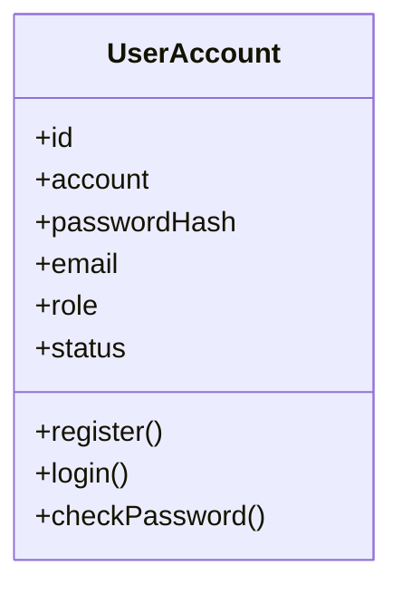
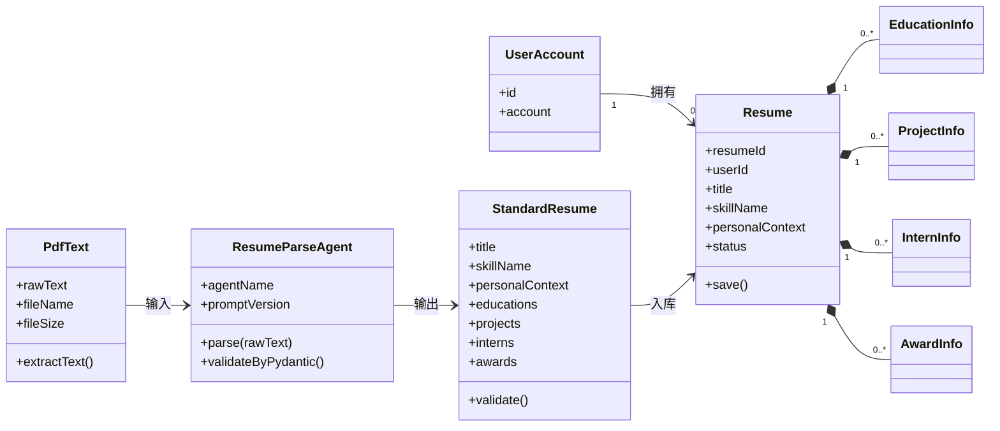
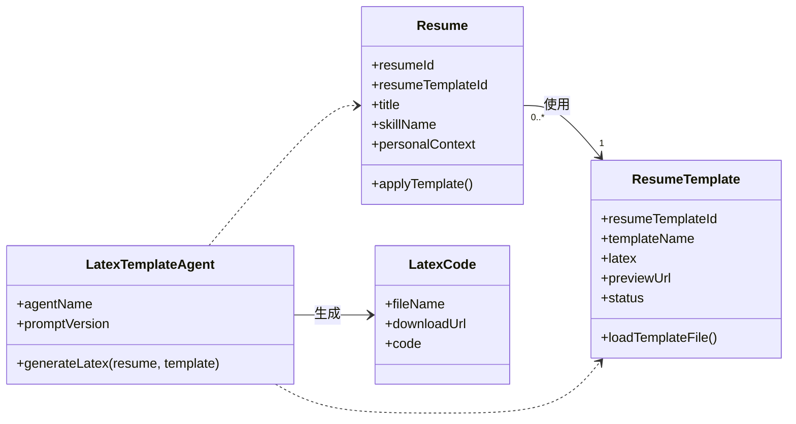
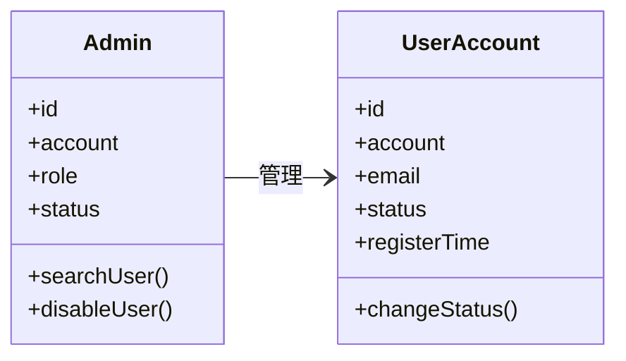

# 领域建模

本部分按照系统核心用例建立领域模型。当前版本把简历拆分为明确的业务实体：`Resume`、`EducationInfo`、`ProjectInfo`、`InternInfo`、`AwardInfo`。这些实体与数据库精简版 9 张表保持一致。

系统主线如下：

1. 用户上传 PDF 简历。
2. 系统把 PDF 抽取为字符串文本。
3. 简历解析 Agent 将字符串解析成标准 Pydantic 对象。
4. 系统把标准对象保存到 MySQL 的简历主表和经历明细表中。
5. 用户校对和修改解析结果。
6. 用户选择系统预置的 LaTeX 模板。
7. 模板 Agent 读取简历信息和模板 LaTeX 文件，生成可下载的 LaTeX 简历代码。
8. 用户输入 Boss 直聘等岗位 URL，系统抓取岗位内容并保存到 `job` 表。
9. 岗位分析 Agent 基于简历和岗位内容分析匹配度、合适性和置信来源。
10. 简历优化 Agent 基于已保存的真实简历内容给出优化建议，不虚构经历、数字和成果。

## UC-01 用户注册与登录

### 概念类

| 概念类 | 说明 |
|---|---|
| UserAccount 用户账号 | 表示系统中的登录身份，可区分普通用户和管理员 |

### 属性与必要方法

| 概念类 | 简单属性 | 必要方法 |
|---|---|---|
| UserAccount | id、account、passwordHash、email、role、status、registerTime、lastLoginTime | register()、login()、checkPassword()、changeStatus() |

### 主要关系

| 关系 | 说明 |
|---|---|
| UserAccount 1 —— 0..* Resume | 一个用户可以拥有多份简历 |

### Mermaid 类图

```mermaid
classDiagram
direction LR

class UserAccount {
  +id
  +account
  +passwordHash
  +email
  +role
  +status
  +register()
  +login()
  +checkPassword()
}
```

---

## UC-02 PDF 简历解析入库

### 概念类

| 概念类 | 说明 |
|---|---|
| UserAccount 用户账号 | 上传 PDF 简历的用户 |
| PdfText PDF 文本 | PDF 抽取出的字符串文本，属于解析过程数据 |
| ResumeParseAgent 简历解析 Agent | 将 PDF 字符串解析为标准简历对象 |
| StandardResume 标准简历对象 | Agent 输出的 Pydantic 校验对象 |
| Resume 简历 | 入库后的简历主信息 |
| EducationInfo 教育背景 | 简历中的教育经历 |
| ProjectInfo 项目经历 | 简历中的项目经历 |
| InternInfo 实习经历 | 简历中的实习经历 |
| AwardInfo 获奖经历 | 简历中的获奖经历 |

### 属性与必要方法

| 概念类 | 简单属性 | 必要方法 |
|---|---|---|
| PdfText | rawText、fileName、fileSize | extractText() |
| ResumeParseAgent | agentName、promptVersion | parse(rawText)、validateByPydantic() |
| StandardResume | title、skillName、personalContext、educations、projects、interns、awards | validate() |
| Resume | resumeId、userId、title、skillName、personalContext、status | createFromStandardResume()、save() |
| EducationInfo | educationInfoId、resumeId、university、major、degree、startTime、endTime | save() |
| ProjectInfo | projectInfoId、resumeId、projectName、role、introduction、content、startTime、endTime | save() |
| InternInfo | internInfoId、resumeId、company、role、content、startTime、endTime | save() |
| AwardInfo | awardInfoId、resumeId、name、awardTime | save() |

### 主要关系

| 关系 | 说明 |
|---|---|
| UserAccount 1 —— 0..* Resume | 一个用户可以上传并保存多份简历 |
| PdfText 1 —— 1 StandardResume | 一份 PDF 文本解析为一个标准简历对象 |
| Resume 1 —— 0..* EducationInfo | 一份简历包含多条教育背景 |
| Resume 1 —— 0..* ProjectInfo | 一份简历包含多条项目经历 |
| Resume 1 —— 0..* InternInfo | 一份简历包含多条实习经历 |
| Resume 1 —— 0..* AwardInfo | 一份简历包含多条获奖经历 |

### Mermaid 类图

```mermaid
classDiagram
direction LR

class UserAccount {
  +id
  +account
}

class PdfText {
  +rawText
  +fileName
  +fileSize
  +extractText()
}

class ResumeParseAgent {
  +agentName
  +promptVersion
  +parse(rawText)
  +validateByPydantic()
}

class StandardResume {
  +title
  +skillName
  +personalContext
  +educations
  +projects
  +interns
  +awards
  +validate()
}

class Resume {
  +resumeId
  +userId
  +title
  +skillName
  +personalContext
  +status
  +save()
}

class EducationInfo
class ProjectInfo
class InternInfo
class AwardInfo

UserAccount "1" --> "0..*" Resume : 拥有
PdfText --> ResumeParseAgent : 输入
ResumeParseAgent --> StandardResume : 输出
StandardResume --> Resume : 入库
Resume "1" *-- "0..*" EducationInfo
Resume "1" *-- "0..*" ProjectInfo
Resume "1" *-- "0..*" InternInfo
Resume "1" *-- "0..*" AwardInfo
```

---

## UC-03 用户校对与编辑简历

### 概念类

| 概念类 | 说明 |
|---|---|
| UserAccount 用户账号 | 校对和编辑简历的用户 |
| Resume 简历 | 被校对和修改的简历主表对象 |
| EducationInfo 教育背景 | 用户可修改的教育经历 |
| ProjectInfo 项目经历 | 用户可修改的项目经历 |
| InternInfo 实习经历 | 用户可修改的实习经历 |
| AwardInfo 获奖经历 | 用户可修改的获奖经历 |

### 属性与必要方法

| 概念类 | 简单属性 | 必要方法 |
|---|---|---|
| Resume | resumeId、userId、title、skillName、personalContext、status、updatedAt | loadDetail()、update()、validateOwner() |
| EducationInfo | university、major、degree、startTime、endTime | update() |
| ProjectInfo | projectName、role、introduction、content、startTime、endTime | update() |
| InternInfo | company、role、content、startTime、endTime | update() |
| AwardInfo | name、awardTime | update() |

### 主要关系

| 关系 | 说明 |
|---|---|
| UserAccount 1 —— 0..* Resume | 用户只能编辑自己的简历 |
| Resume 1 —— 0..* EducationInfo | 编辑教育背景 |
| Resume 1 —— 0..* ProjectInfo | 编辑项目经历 |
| Resume 1 —— 0..* InternInfo | 编辑实习经历 |
| Resume 1 —— 0..* AwardInfo | 编辑获奖经历 |

---

## UC-04 选择模板并生成 LaTeX 简历

### 概念类

| 概念类 | 说明 |
|---|---|
| UserAccount 用户账号 | 选择模板并生成 LaTeX 的用户 |
| Resume 简历 | 待生成 LaTeX 代码的简历 |
| ResumeTemplate 简历模板 | 系统预置的 LaTeX 代码模板 |
| LatexTemplateAgent 模板 Agent | 读取简历信息和模板文件，生成最终 LaTeX 代码 |
| LatexCode LaTeX 代码 | 返回给用户下载的代码结果 |

### 属性与必要方法

| 概念类 | 简单属性 | 必要方法 |
|---|---|---|
| ResumeTemplate | resumeTemplateId、templateName、latex、previewUrl、status | loadTemplateFile() |
| LatexTemplateAgent | agentName、promptVersion | generateLatex(resume, template) |
| LatexCode | fileName、downloadUrl、code | createDownloadLink() |
| Resume | resumeId、resumeTemplateId、title、skillName、personalContext | applyTemplate() |

### 主要关系

| 关系 | 说明 |
|---|---|
| Resume 0..1 —— 1 ResumeTemplate | 一份简历可选择一个系统预置模板 |
| ResumeTemplate 1 —— 0..* Resume | 一个模板可被多份简历使用 |
| LatexTemplateAgent 依赖 Resume 和 ResumeTemplate | 模板 Agent 根据简历信息和 LaTeX 模板文件生成代码 |

### Mermaid 类图

```mermaid
classDiagram
direction LR

class Resume {
  +resumeId
  +resumeTemplateId
  +title
  +skillName
  +personalContext
  +applyTemplate()
}

class ResumeTemplate {
  +resumeTemplateId
  +templateName
  +latex
  +previewUrl
  +status
  +loadTemplateFile()
}

class LatexTemplateAgent {
  +agentName
  +promptVersion
  +generateLatex(resume, template)
}

class LatexCode {
  +fileName
  +downloadUrl
  +code
}

Resume "0..*" --> "1" ResumeTemplate : 使用
LatexTemplateAgent ..> Resume
LatexTemplateAgent ..> ResumeTemplate
LatexTemplateAgent --> LatexCode : 生成
```

---

## UC-05 岗位 URL 解析与匹配分析

### 概念类

| 概念类 | 说明 |
|---|---|
| UserAccount 用户账号 | 输入岗位 URL 的用户 |
| Resume 简历 | 用于岗位匹配分析的简历 |
| Job 岗位 | 保存岗位 URL、岗位正文和岗位分析结果 |
| JobCrawler 岗位抓取器 | 抓取 Boss 直聘等页面中的岗位内容 |
| JobAnalysisAgent 岗位分析 Agent | 分析岗位是否适合当前简历，给出匹配度和置信来源 |

### 属性与必要方法

| 概念类 | 简单属性 | 必要方法 |
|---|---|---|
| Job | jobId、resumeId、jobUrl、jobName、company、content、status | fetchContent()、save()、markParsed()、markFailed() |
| JobCrawler | source、url | crawl(jobUrl) |
| JobAnalysisAgent | agentName、promptVersion | analyzeFit(resume, jobContent) |
| Resume | resumeId、skillName、projects、interns | buildMatchContext() |

### 主要关系

| 关系 | 说明 |
|---|---|
| Resume 1 —— 0..* Job | 一份简历可以关联多个目标岗位 |
| JobCrawler 读取 Job.jobUrl | 抓取岗位正文 |
| JobAnalysisAgent 依赖 Resume 和 Job.content | 生成匹配度、是否合适、置信来源等分析结果 |

---

## UC-06 简历优化建议

### 概念类

| 概念类 | 说明 |
|---|---|
| Resume 简历 | 被优化分析的简历 |
| Job 岗位 | 可选的目标岗位上下文 |
| Opt 优化建议 | 保存优化 Agent 输出的建议、评分和状态 |
| ResumeOptimizeAgent 简历优化 Agent | 分析简历内容是否合理、技能是否足够、项目和实习表达是否符合 STAR/STAT 法则 |

### 属性与必要方法

| 概念类 | 简单属性 | 必要方法 |
|---|---|---|
| Opt | optId、resumeId、jobId、content、score、status | create()、save()、markUsed() |
| ResumeOptimizeAgent | agentName、promptVersion | optimize(resume, job)、checkNoFabrication() |
| Resume | resumeId、skillName、personalContext、projects、interns、awards | buildOptimizeContext() |
| Job | jobId、content | provideJobContext() |

### 主要关系

| 关系 | 说明 |
|---|---|
| Resume 1 —— 0..* Opt | 一份简历可以生成多条优化记录 |
| Job 0..1 —— 0..* Opt | 优化建议可以针对某个岗位生成，也可以只针对简历本身生成 |
| ResumeOptimizeAgent 依赖 Resume 和可选 Job | Agent 只能基于已有内容提出建议，不能虚构经历或数据 |

---

## UC-07 管理用户账号

### 概念类

| 概念类 | 说明 |
|---|---|
| Admin 管理员 | 具有管理员角色的用户账号 |
| UserAccount 用户账号 | 被查询或禁用的平台用户账号 |

### 属性与必要方法

| 概念类 | 简单属性 | 必要方法 |
|---|---|---|
| Admin | id、account、role、status | searchUser()、disableUser() |
| UserAccount | id、account、email、status、registerTime | changeStatus() |

### 主要关系

| 关系 | 说明 |
|---|---|
| Admin 1 —— 0..* UserAccount | 管理员可以查询和禁用多个用户账号 |

### Mermaid 类图

```mermaid
classDiagram
direction LR

class Admin {
  +id
  +account
  +role
  +status
  +searchUser()
  +disableUser()
}

class UserAccount {
  +id
  +account
  +email
  +status
  +registerTime
  +changeStatus()
}

Admin --> UserAccount : 管理
```
